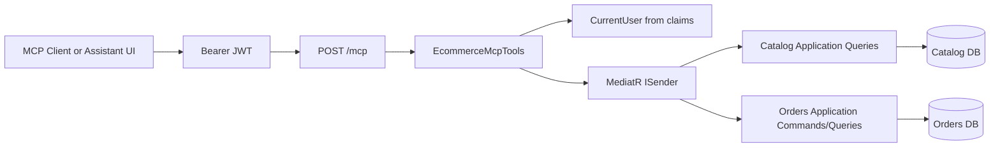
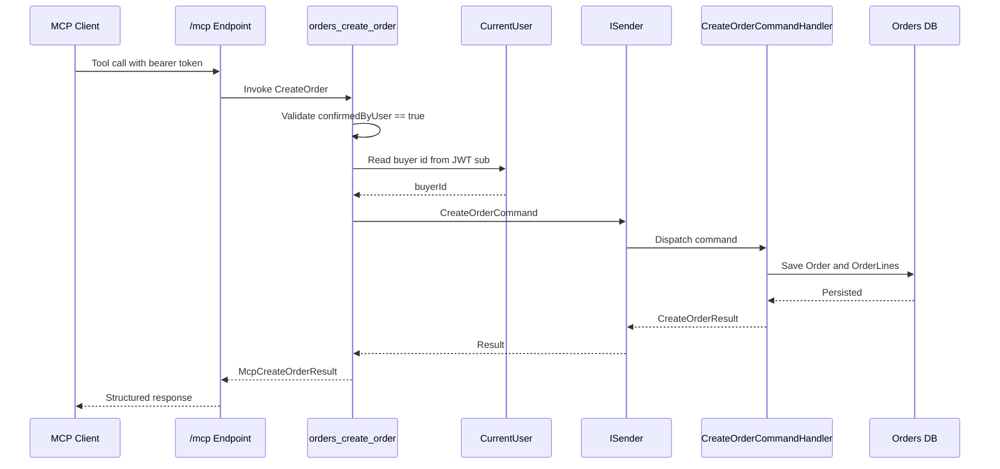
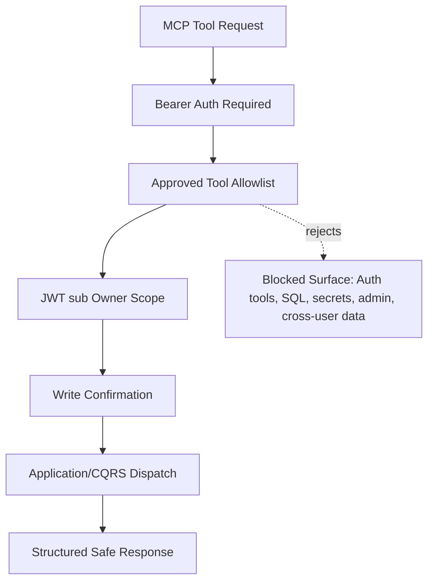

# ZY-Commerce MCP Demo

Focused technical walkthrough for the MCP implementation.

Goal: explain what was built, why it is safe, how it is wired, and how to demo it without missing the key points.

Speaker cue: "This is not a generic MCP overview. This is how MCP was implemented in our backend and how it respects our architecture."

---

# What MCP Adds

MCP exposes selected backend capabilities as model-callable tools.

In this project, MCP enables:

- Product search through a tool interface.
- Product detail lookup by id.
- Owner-scoped order detail lookup.
- Confirmed order creation through structured tool input.

Important framing:

- MCP is an adapter, not a new business layer.
- MCP does not replace REST APIs.
- MCP does not bypass Application/CQRS.

Speaker cue: "The value is controlled tool access for AI-assisted workflows, not automatic exposure of the whole API."

---

# Why We Implemented It This Way

Decision: host MCP inside `Ecommerce.Api`.

Accepted approach:

- Use official `ModelContextProtocol.AspNetCore` package.
- Host protected `/mcp`.
- Use stateless Streamable HTTP transport.
- Register an explicit tool allowlist.
- Dispatch existing Application requests through `ISender`.

Rejected approaches:

- Separate MCP process for the first slice.
- MCP tools calling EF Core or repositories directly.
- Automatically exposing all APIs as tools.

Speaker cue: "We chose the smallest useful MCP surface that preserves the existing architecture."

---

# Implementation Location

Main files:

- `src/Api/Ecommerce.Api/Program.cs`
- `src/Api/Ecommerce.Api/Mcp/EcommerceMcpTools.cs`
- `src/Api/Ecommerce.Api/Mcp/CurrentUser.cs`
- `tests/ArchitectureTests/Ecommerce.ArchitectureTests/McpIntegrationTests.cs`
- `docs/decisions/ADR-003-mcp-server-boundary-and-security.md`

Package:

- `ModelContextProtocol.AspNetCore` version `1.4.0`

Speaker cue: "Everything MCP-specific lives in the API layer, which keeps module internals clean."

---

# Host Wiring

The API registers MCP during service setup:

```csharp
builder.Services
    .AddMcpServer()
    .WithHttpTransport(options =>
    {
        options.Stateless = true;
    })
    .AddAuthorizationFilters()
    .WithTools<EcommerceMcpTools>();
```

The endpoint is mapped as protected:

```csharp
app.MapMcp("/mcp").RequireAuthorization();
```

Speaker cue: "The two details to call out are stateless transport and required authorization."

---

# MCP Architecture



Speaker cue: "MCP enters through the API host, then immediately goes through the same Application boundary as REST."

---

# Boundary Rule

MCP tools depend on one dispatcher:

```csharp
public sealed class EcommerceMcpTools(ISender sender)
```

What this means:

- No direct DbContext access.
- No direct repository access.
- No direct Domain object orchestration.
- No dependency on module Infrastructure internals.
- Existing handlers remain the source of business behavior.

Speaker cue: "This is the key architecture point: MCP is another transport adapter, not another service implementation."

---

# Approved Tool Allowlist

Only four MCP tools are exposed:

| Tool | Type | Purpose |
|---|---|---|
| `catalog_search_products` | Read-only | Search products with optional filters and pagination |
| `catalog_get_product_by_id` | Read-only | Get public product details |
| `orders_get_order_by_id` | Read-only | Get one order for the authenticated owner |
| `orders_create_order` | Destructive | Create order after explicit user confirmation |

Speaker cue: "The allowlist is deliberate. We do not expose Auth, admin, health readiness details, SQL, or general API access."

---

# Catalog Search Tool

Tool:

```csharp
[McpServerTool(
    Name = "catalog_search_products",
    Title = "Search Catalog Products",
    ReadOnly = true,
    UseStructuredContent = true)]
```

Inputs:

- `searchTerm`
- `isActive`
- `pageNumber`
- `pageSize`

Dispatches:

- `SearchProductsQuery`

Returns:

- Paged product list.
- Pagination metadata.

Speaker cue: "This is safe to expose because catalog search is already public in REST, and it uses the same query handler."

---

# Catalog Get Product Tool

Tool:

```csharp
[McpServerTool(
    Name = "catalog_get_product_by_id",
    Title = "Get Catalog Product By Id",
    ReadOnly = true,
    UseStructuredContent = true)]
```

Input:

- `productId`

Dispatches:

- `GetProductByIdQuery`

Returns:

- Product id.
- SKU.
- Name.
- Description.
- Active state.
- Created/updated timestamps.

Speaker cue: "This mirrors public product details and does not expose catalog write operations."

---

# Order Detail Tool

Tool:

```csharp
[McpServerTool(
    Name = "orders_get_order_by_id",
    Title = "Get Order By Id",
    ReadOnly = true,
    UseStructuredContent = true)]
```

Input:

- `orderId`

Owner scoping:

```csharp
CurrentUser.TryGetUserId(context.User, out var buyerId)
```

Dispatches:

- `GetOrderByIdQuery(orderId, buyerId)`

Speaker cue: "The tool schema does not accept userId or buyerId. Owner scope comes only from the authenticated principal."

---

# Create Order Tool

Tool:

```csharp
[McpServerTool(
    Name = "orders_create_order",
    Title = "Create Order",
    Destructive = true,
    OpenWorld = false,
    UseStructuredContent = true)]
```

Required input:

- `confirmedByUser`
- `lines`

Safety check:

```csharp
if (!confirmedByUser)
{
    throw new InvalidOperationException(
        "orders_create_order requires confirmedByUser to be true.");
}
```

Speaker cue: "This is the only write tool, and it requires explicit confirmation before dispatching the command."

---

# Create Order Data Flow



Speaker cue: "The flow is intentionally boring in a good way: confirm, identify user, dispatch command, return result."

---

# Authentication And User Scope

Authentication:

- `/mcp` requires bearer authentication.
- MCP tools are marked with `[Authorize]`.
- Authorization filters are added to the MCP server.

User scope:

- `CurrentUser` extracts `sub` claim from the authenticated principal.
- Order tools do not accept user id, buyer id, or context as model-provided inputs.
- Missing or invalid `sub` results in unauthorized behavior.

Speaker cue: "This prevents a model or client from asking for someone else's order by passing a different buyer id."

---

# What MCP Does Not Expose

Intentionally absent:

- Auth register/login tools.
- JWTs, passwords, or authorization headers.
- Raw database access.
- SQL execution.
- Migrations.
- Health readiness details.
- Appsettings or environment variables.
- Catalog write tools.
- Cross-user orders.
- Non-existent Orders features like cancellation, refunds, shipping, or payments.

Speaker cue: "This slide is important for risk review. MCP is powerful, so absence is part of the design."

---

# Safety Model



Speaker cue: "The safety model is layered: authentication, allowlist, owner scope, confirmation, and CQRS boundaries."

---

# Structured Tool Responses

MCP response DTOs are separate from internal domain models:

- `McpCatalogSearchProductsResult`
- `McpProductListItem`
- `McpProductDetails`
- `McpOrderDetails`
- `McpOrderLineDetails`
- `McpCreateOrderLineInput`
- `McpCreateOrderResult`

Why this matters:

- The MCP contract is explicit.
- Internal domain types are not leaked.
- Response shape can be reviewed per tool.
- Future tool changes stay isolated to the API adapter.

Speaker cue: "The model sees structured DTOs, not our EF entities or domain aggregates."

---

# Test Evidence

Architecture tests verify:

- `EcommerceMcpTools` requires authorization.
- `/mcp` is mapped with `RequireAuthorization`.
- Only the approved four tools are exposed.
- MCP tools depend on `ISender` only for application dispatch.
- Order tool schemas do not expose authenticated user context.
- MCP adapter types do not depend on EF Core, repositories, Domain, or module persistence internals.

Behavior tests verify:

- Catalog tools dispatch the expected queries.
- Order detail dispatches owner-scoped query.
- Create order refuses `confirmedByUser = false`.
- Create order dispatches command for authenticated user.

Speaker cue: "The tests protect both behavior and architecture, which is exactly what we need for a model-facing surface."

---

# Demo Prerequisites

Before demo:

- Backend running in Development.
- Auth database available.
- Catalog and Orders databases available.
- A registered user.
- A valid JWT bearer token from login.
- At least one product exists.
- Optional: at least one order exists for order detail demo.

If using Swagger first:

- Register/login through REST.
- Copy `accessToken`.
- Use bearer token for MCP client calls.

Speaker cue: "The MCP endpoint is protected, so the demo starts with normal Auth."

---

# Demo Flow

1. Show `Program.cs` MCP registration.
2. Show `app.MapMcp("/mcp").RequireAuthorization()`.
3. Show `EcommerceMcpTools` and the four tool attributes.
4. Demo `catalog_search_products`.
5. Demo `catalog_get_product_by_id`.
6. Demo `orders_get_order_by_id` with authenticated owner.
7. Demo `orders_create_order` with `confirmedByUser = false`.
8. Demo `orders_create_order` with `confirmedByUser = true`.
9. Show architecture tests proving allowlist and boundaries.

Speaker cue: "Move from wiring, to tool surface, to safety behavior, to test evidence."

---

# Demo Script: Catalog Search

Say:

"First, I will call a read-only MCP tool for catalog search. This maps to the same `SearchProductsQuery` used by the REST catalog endpoint."

Expected backend path:

- MCP client calls `/mcp`.
- JWT is validated.
- `catalog_search_products` is invoked.
- Tool sends `SearchProductsQuery`.
- Catalog read repository returns paged products.

Expected result:

- Product items.
- Page number.
- Page size.
- Total count.
- Total pages.

Speaker cue: "Point out `ReadOnly = true` and `UseStructuredContent = true`."

---

# Demo Script: Order Detail

Say:

"Now I will get an order by id. Notice I pass only `orderId`; I do not pass `buyerId`."

Expected backend path:

- Tool extracts buyer id from authenticated JWT `sub`.
- Tool dispatches `GetOrderByIdQuery(orderId, buyerId)`.
- Orders read repository filters by both order id and buyer id.

Expected result:

- Owner's order details are returned.
- Cross-user order returns null/not found behavior through the underlying query.

Speaker cue: "This is the strongest owner-scope demo."

---

# Demo Script: Confirmed Order Creation

Say:

"This is the only destructive MCP tool. First, I will call it without confirmation to show it refuses to run."

Expected result:

- `confirmedByUser = false` throws an invalid operation.
- `ISender` is not called.
- No database change happens.

Then say:

"Now I will call the same tool with explicit confirmation."

Expected backend path:

- Validate confirmation.
- Extract buyer id from JWT.
- Dispatch `CreateOrderCommand`.
- Save order and snapshot lines.

Speaker cue: "This proves model-triggered writes require a deliberate confirmation flag."

---

# Key Code To Show

Open these in order:

1. `Program.cs`
   - `AddMcpServer`
   - `WithHttpTransport`
   - `options.Stateless = true`
   - `AddAuthorizationFilters`
   - `WithTools<EcommerceMcpTools>`
   - `MapMcp("/mcp").RequireAuthorization()`

2. `EcommerceMcpTools.cs`
   - Tool attributes.
   - `ISender` constructor.
   - `CurrentUser.TryGetUserId`.
   - `confirmedByUser` guard.

3. `McpIntegrationTests.cs`
   - Allowlist test.
   - Authorization test.
   - No EF/repository/domain dependency test.

Speaker cue: "This sequence shows the whole implementation from host setup to safety enforcement."

---

# Technical Talking Points

- MCP was implemented as an API adapter, not as a module.
- It uses the same authentication model as protected REST endpoints.
- It uses existing Application/CQRS requests.
- It exposes only reviewed tools.
- Tool contracts are explicit DTOs.
- Order tools are owner-scoped by JWT `sub`.
- The only write tool requires explicit confirmation.
- Architecture tests prevent future boundary drift.

Speaker cue: "The design keeps MCP useful, but narrow."

---

# Risks And Mitigations

| Risk | Mitigation |
|---|---|
| Overexposing backend capabilities | Explicit tool allowlist |
| Cross-user data access | Buyer id from JWT `sub`, not tool input |
| Direct persistence bypass | MCP tools dispatch through `ISender` |
| Accidental write execution | `confirmedByUser` required |
| Secret or operational leakage | Auth, tokens, SQL, appsettings, env vars not exposed |
| Future boundary drift | Architecture tests |

Speaker cue: "Every MCP risk maps to a concrete implementation guardrail."

---

# Known Tradeoffs

- MCP adds one API package dependency.
- Tool schemas must be maintained separately from REST contracts.
- No dedicated MCP scopes, roles, rate limits, or OAuth resource metadata yet.
- `orders_create_order` inherits current order snapshot trust tradeoff until Catalog validation is added.
- Frontend MCP execution is documented as partially implemented/skeleton in the broader docs.

Speaker cue: "The implementation is intentionally conservative and ready for the next hardening phase."

---

# Future Improvements

Next MCP hardening steps:

- Add dedicated scopes or role-based access for MCP tools.
- Add rate limiting for `/mcp`.
- Add audit logging for tool calls without sensitive payloads.
- Add richer tool metadata for frontend discovery.
- Add Catalog validation for order creation.
- Add new tools only through ADR and allowlist review.
- Add explicit production MCP client configuration guidance.

Speaker cue: "The rule for future tools should be: reviewed, scoped, tested, and routed through Application."

---

# Q&A Prep

Question: "Can MCP access the database directly?"

Answer: "No. MCP tools depend on `ISender` and dispatch Application/CQRS requests. Architecture tests prevent EF Core, repository, Domain, or persistence dependencies in MCP adapter types."

Question: "Can a user request another user's order?"

Answer: "The tool schema does not accept buyer id. Buyer id is extracted from JWT `sub`, and the Orders query is owner-scoped."

Question: "Can the model create orders accidentally?"

Answer: "`orders_create_order` is marked destructive and requires `confirmedByUser = true`; without it, the command is not dispatched."

Question: "Why no Auth tools?"

Answer: "Auth tools would expose high-risk credential/token flows. They were intentionally excluded from the allowlist."

---

# Closing Message

MCP in ZY-Commerce is:

- Authenticated.
- Explicitly allowlisted.
- Owner-scoped.
- CQRS-routed.
- Structured.
- Tested.
- Conservative by design.

Speaker cue: "The takeaway: we added an AI/tooling integration point without weakening the backend architecture."

