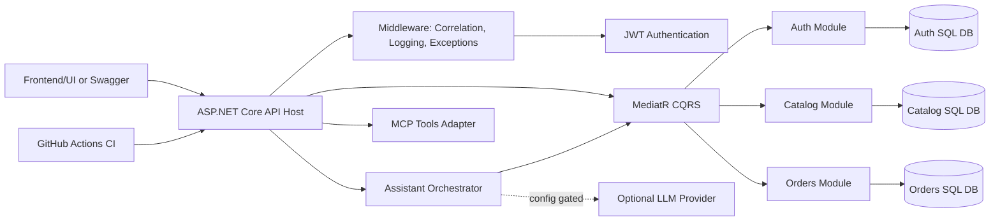
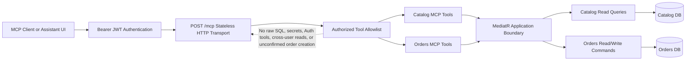
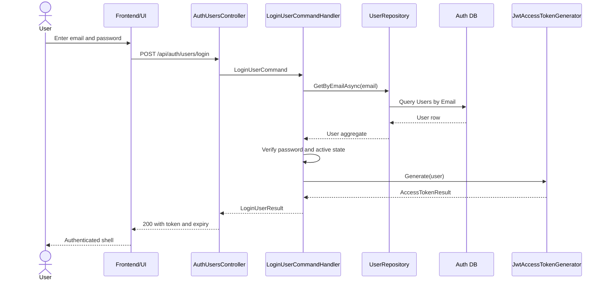
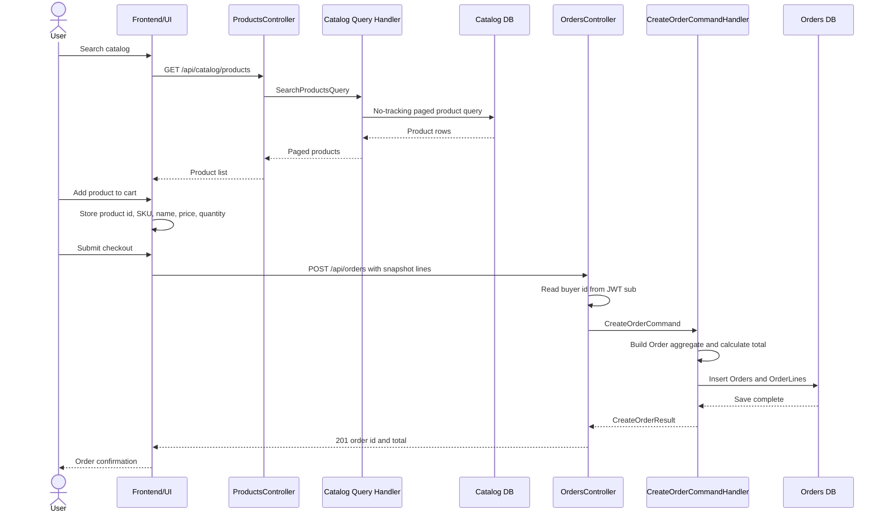
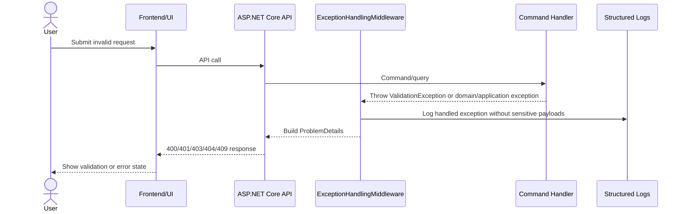
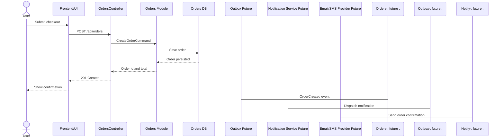
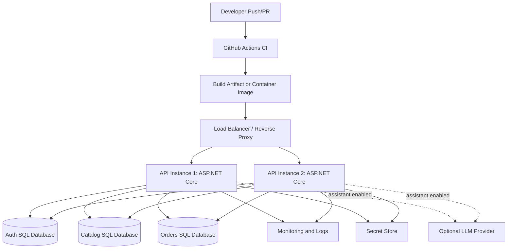

# ZY-Commerce Backend Technical Demo Package

Generated: 2026-06-22

Audience: engineering team, backend reviewers, solution architects, and product/technical stakeholders.

Project: ZY-Commerce Backend

Implementation type: .NET 9 ASP.NET Core modular monolith for ecommerce APIs.

Core stack: ASP.NET Core, .NET 9, Clean Architecture, DDD tactical patterns, CQRS with MediatR, FluentValidation, EF Core, SQL Server LocalDB for development, JWT bearer authentication, Swagger/OpenAPI, GitHub Actions CI, MCP endpoint, backend assistant orchestration.

Implemented modules:

- Auth: user registration, login, current user, password hashing, JWT access token generation.
- Catalog: product creation, search/list, get by id, update details, deactivate, reactivate, catalog-owned price.
- Orders: create order, list current user's orders, get current user's order by id, product snapshot lines.
- Platform: global exception handling, validation problem details, correlation id middleware, structured request logging, health checks, Swagger security, MCP endpoint, assistant endpoint.

Frontend/UI note: the backend repository includes frontend-facing contracts and demo flow references. The live UI is expected to be in the sibling `zy-commerce-frontend` project referenced by the docs.

## 1. Executive Summary

### What Was Implemented

ZY-Commerce now has a production-shaped backend foundation for an ecommerce application. The implementation includes user authentication, product catalog management, order creation and history, platform diagnostics, secure API documentation, a protected MCP tool surface, and a backend assistant endpoint for read-only ecommerce questions.

### Problem Solved

The system turns a basic ecommerce idea into a structured backend with clear business boundaries. Users can authenticate, browse products, create orders, and view their own order history. Engineering teams get a modular architecture that keeps Auth, Catalog, and Orders isolated, so future work can be added without creating tight coupling between modules.

### Expected Benefits

- Faster feature delivery because each module has clear ownership.
- Safer API behavior through JWT authentication, validation, and global error handling.
- Better demo readiness through Swagger, health checks, logging, and clear API contracts.
- Better long-term maintainability through Clean Architecture, CQRS, DDD aggregates, architecture tests, and ADRs.
- AI/tool readiness through a protected MCP endpoint and controlled assistant orchestration.

### Main Use Cases

- Register and login as a user.
- Retrieve the current authenticated user.
- Browse and search products.
- Create, update, deactivate, and reactivate products through protected catalog write APIs.
- Create an order from cart snapshot data.
- View current user's order list and order details.
- Ask safe assistant questions such as recent orders, total spend, ordered products, or products under a price.
- Verify platform readiness through health endpoints.

## 2. Implementation Architecture

### High-Level Architecture

The solution is a modular monolith. A single ASP.NET Core API hosts all HTTP endpoints, but business capabilities are separated into modules:

- Auth owns identity, users, password hashes, and token generation.
- Catalog owns product lifecycle and product search.
- Orders owns order history, buyer-scoped reads, and captured product snapshots.
- API layer owns transport concerns, controllers, middleware, Swagger, MCP, assistant orchestration, and health checks.

Each module follows Clean Architecture:

- Domain: aggregates, value objects, and core business rules.
- Application: commands, queries, validators, handlers, and abstractions.
- Infrastructure: EF Core DbContext, repositories, migrations, and technical implementations.
- Contracts: request and response DTOs exposed to the API/frontend.

### Component Interaction Flow

1. Client calls a REST endpoint or MCP endpoint.
2. API middleware applies correlation id, request logging, exception handling, authentication, and authorization.
3. Controller or MCP adapter maps transport input into a MediatR command/query.
4. Application handler validates and executes business behavior.
5. Domain model enforces invariants.
6. Infrastructure repository persists or reads through EF Core.
7. API maps results into contract responses.

### Backend Service Responsibilities

- API host: routing, middleware, auth, Swagger, health checks, MCP, assistant orchestration.
- Auth module: user lifecycle, credentials, JWT token issuing.
- Catalog module: product lifecycle, product read model, public search/detail reads, protected writes.
- Orders module: order aggregate creation, owner-scoped order reads, order totals, order line snapshots.
- Assistant/MCP adapters: expose controlled tool and natural-language surfaces without bypassing Application/CQRS boundaries.

### External Integrations

- SQL Server LocalDB for local development persistence.
- Optional LLM provider endpoint configured as `https://api.openai.com/v1/responses`; API key is resolved from `ECOMMERCE_ASSISTANT_LLM_API_KEY` or non-committed configuration.
- Swagger UI for local development API exploration.
- GitHub Actions for restore/build/test CI.

### Data Flow Explanation

- Auth writes users to the Auth database and returns signed JWT access tokens.
- Catalog writes products to the Catalog database and exposes read-optimized queries for search/detail views.
- Orders writes orders to the Orders database using buyer id from JWT `sub`.
- Order lines store product id, SKU, name, unit price, and quantity as historical snapshot facts.
- Assistant reads Catalog and Orders through existing MediatR queries and never accepts buyer id from the request body.

### Mermaid Architecture Diagram



### MCP Feature Architecture Diagram



MCP demo message: the MCP endpoint is an authenticated adapter over approved application commands and queries. It does not bypass the module architecture or expose internal database access.

## 3. Backend Deep Dive

### Auth Service

Service Name: Auth

Purpose: Manage users, credential validation, and JWT access tokens.

Endpoints:

- `POST /api/auth/users/register`
- `POST /api/auth/users/login`
- `GET /api/auth/users/me`

Business Logic:

- Validates email and password format.
- Prevents duplicate email registration.
- Hashes passwords before persistence.
- Rejects invalid credentials and inactive users.
- Issues short-lived signed JWT access tokens.
- Reads current user identity from JWT `sub` and `email` claims.

Dependencies:

- `IUserRepository`
- `IAuthUnitOfWork`
- `IPasswordHasher`
- `IAccessTokenGenerator`
- `AuthDbContext`

Error Handling:

- Validation errors return `400 ValidationProblemDetails`.
- Duplicate email returns `409 Conflict`.
- Invalid credentials return `401 Unauthorized`.
- Inactive user returns `403 Forbidden`.

Security:

- Password hash is stored instead of raw password.
- JWT includes `sub`, `email`, `jti`, and `iat`.
- JWT validates issuer, audience, signing key, lifetime, signature, and expiration.
- No refresh token or role model is currently implemented.

Performance Considerations:

- Unique email index supports fast login and duplicate checks.
- Auth module is isolated from Catalog and Orders to prevent unnecessary joins.

### Catalog Service

Service Name: Catalog

Purpose: Manage products and expose searchable product information.

Endpoints:

- `GET /api/catalog/products`
- `GET /api/catalog/products/{productId}`
- `POST /api/catalog/products`
- `PUT /api/catalog/products/{productId}`
- `DELETE /api/catalog/products/{productId}`
- `POST /api/catalog/products/{productId}/reactivate`

Business Logic:

- Creates products with SKU, name, optional description, active state, and price.
- Enforces unique SKU.
- Supports public product search with optional text, active filter, and pagination.
- Allows protected product writes.
- Supports product lifecycle through deactivate/reactivate.
- Reactivation is idempotent when a product is already active.

Dependencies:

- `IProductRepository`
- `IProductReadRepository`
- `ICatalogUnitOfWork`
- `CatalogDbContext`
- `CatalogReadDbContext`

Error Handling:

- Validation errors return `400`.
- Duplicate SKU returns `409 Conflict`.
- Missing product detail returns `404`.
- Empty product id returns `400`.

Security:

- Product reads are public.
- Product writes require bearer authentication.
- Swagger marks protected operations with authorization metadata.

Performance Considerations:

- Search uses no-tracking EF queries.
- Search supports pagination with max page size 100.
- Unique SKU index supports duplicate detection.
- Query-side read model avoids loading full aggregates for list pages.

### Orders Service

Service Name: Orders

Purpose: Create and retrieve buyer-owned orders.

Endpoints:

- `POST /api/orders`
- `GET /api/orders`
- `GET /api/orders/{orderId}`

Business Logic:

- Creates orders for the authenticated buyer only.
- Buyer id is always taken from JWT `sub`.
- Requires at least one order line.
- Captures product snapshot fields from the create request.
- Calculates line totals and order total from snapshot price and quantity.
- Lists summaries newest first.
- Retrieves full details only for the authenticated owner.

Dependencies:

- `IOrderRepository`
- `IOrderReadRepository`
- `IOrdersUnitOfWork`
- `OrdersDbContext`

Error Handling:

- Missing or invalid JWT user id returns `401`.
- Empty order id returns `400`.
- Missing or cross-user order returns `404`.
- Invalid line data returns `400 ValidationProblemDetails`.

Security:

- Entire controller is protected by `[Authorize]`.
- Owner scoping is enforced in queries by buyer id.
- Cross-user order access intentionally returns `404` to avoid leaking order existence.

Performance Considerations:

- List endpoint returns summaries only, not full order lines.
- Order details loads lines only for one order.
- Buyer id index supports owner-scoped order history.
- Pagination max page size is 100.

### Assistant Service

Service Name: Assistant

Purpose: Answer safe ecommerce questions by composing existing read-side Catalog and Orders capabilities.

Endpoints:

- `POST /api/assistant/query`

Business Logic:

- Accepts a natural-language `question`.
- Supports recent orders, total spend, products ordered, matching orders, most frequently purchased product, catalog products under an amount, and catalog product lookup.
- Uses deterministic interpreter by default/fallback.
- Can use config-gated LLM intent interpretation.
- Validates all interpreter output against an allowlist before dispatch.

Dependencies:

- `AssistantOrchestrator`
- `IAssistantIntentInterpreter`
- `AssistantIntentPlanValidator`
- `AssistantToolRegistry`
- Existing Catalog/Orders MediatR queries

Error Handling:

- Missing or too-long question returns `400`.
- Missing/invalid auth returns `401`.
- Unsafe or unsupported questions return safe structured unsupported response.
- Provider failure falls back to deterministic interpretation when configured.

Security:

- Protected endpoint.
- Read-only capability allowlist.
- Orders analysis scoped only to JWT `sub`.
- No raw SQL, writes, admin actions, token exposure, or cross-user scope.

Performance Considerations:

- Analysis currently works over a bounded first page of owned orders.
- Future high-volume analytics should move to dedicated read models or aggregate queries.

### MCP Tool Service

Service Name: MCP Adapter

Purpose: Expose selected backend capabilities as authenticated MCP tools.

Endpoint:

- `POST /mcp`

Tools:

- `catalog_search_products`
- `catalog_get_product_by_id`
- `orders_get_order_by_id`
- `orders_create_order`

Business Logic:

- Routes tools through existing MediatR commands/queries.
- `orders_create_order` requires `confirmedByUser = true`.

Security:

- Protected endpoint.
- No direct EF Core, repository, domain, SQL, secret, or auth-token exposure.
- Orders tools use authenticated user context.

## 4. API Documentation Summary

Authentication requirements:

- Public: register, login, catalog search, catalog get by id, health endpoints.
- Protected: current user, catalog writes, orders, assistant, MCP.
- Protected calls require `Authorization: Bearer {accessToken}`.

| Endpoint | Method | Purpose | Request | Response |
|---|---|---|---|---|
| `/api/auth/users/register` | POST | Register user | `{ email, password }` | `201 { userId, email }` |
| `/api/auth/users/login` | POST | Login and receive JWT | `{ email, password }` | `200 { userId, email, accessToken, tokenType, expiresAt }` |
| `/api/auth/users/me` | GET | Get current JWT user | Bearer token | `200 { userId, email }` |
| `/api/catalog/products` | GET | Search products | Query: `searchTerm`, `isActive`, `pageNumber`, `pageSize` | `200 paged products` |
| `/api/catalog/products/{productId}` | GET | Get product detail | Product id | `200 product`, `404` |
| `/api/catalog/products` | POST | Create product | Bearer token, `{ sku, name, description, price }` | `201 { productId, sku, name }` |
| `/api/catalog/products/{productId}` | PUT | Update product name/description | Bearer token, `{ name, description }` | `204` |
| `/api/catalog/products/{productId}` | DELETE | Deactivate product | Bearer token | `204` |
| `/api/catalog/products/{productId}/reactivate` | POST | Reactivate product | Bearer token | `204` |
| `/api/orders` | POST | Create buyer order | Bearer token, `{ lines }` | `201 { orderId, totalAmount, createdAt }` |
| `/api/orders` | GET | List current user's orders | Bearer token, pagination query | `200 paged order summaries` |
| `/api/orders/{orderId}` | GET | Get current user's order detail | Bearer token, order id | `200 order`, `404` |
| `/api/assistant/query` | POST | Ask read-only ecommerce question | Bearer token, `{ question }` | `200 assistant response` |
| `/health/live` | GET | Process liveness | None | Health result |
| `/health/ready` | GET | DB readiness | None | Health result |
| `/mcp` | POST | Authenticated MCP transport | Bearer token, MCP payload | MCP response |

### Sample Requests And Responses

Register:

```json
POST /api/auth/users/register
{
  "email": "buyer@example.com",
  "password": "Password123!"
}
```

```json
201 Created
{
  "userId": "11111111-1111-1111-1111-111111111111",
  "email": "buyer@example.com"
}
```

Login:

```json
POST /api/auth/users/login
{
  "email": "buyer@example.com",
  "password": "Password123!"
}
```

```json
200 OK
{
  "userId": "11111111-1111-1111-1111-111111111111",
  "email": "buyer@example.com",
  "accessToken": "<jwt>",
  "tokenType": "Bearer",
  "expiresAt": "2026-06-22T12:15:00+00:00"
}
```

Create product:

```json
POST /api/catalog/products
Authorization: Bearer <jwt>
{
  "sku": "SKU-001",
  "name": "Wireless Mouse",
  "description": "Ergonomic mouse",
  "price": 19.99
}
```

```json
201 Created
{
  "productId": "22222222-2222-2222-2222-222222222222",
  "sku": "SKU-001",
  "name": "Wireless Mouse"
}
```

Search products:

```json
GET /api/catalog/products?searchTerm=mouse&isActive=true&pageNumber=1&pageSize=20
```

```json
200 OK
{
  "items": [
    {
      "productId": "22222222-2222-2222-2222-222222222222",
      "sku": "SKU-001",
      "name": "Wireless Mouse",
      "description": "Ergonomic mouse",
      "price": 19.99,
      "isActive": true,
      "createdAt": "2026-06-22T12:00:00+00:00"
    }
  ],
  "pageNumber": 1,
  "pageSize": 20,
  "totalCount": 1,
  "totalPages": 1,
  "hasPreviousPage": false,
  "hasNextPage": false
}
```

Create order:

```json
POST /api/orders
Authorization: Bearer <jwt>
{
  "lines": [
    {
      "productId": "22222222-2222-2222-2222-222222222222",
      "productSku": "SKU-001",
      "productName": "Wireless Mouse",
      "unitPrice": 19.99,
      "quantity": 2
    }
  ]
}
```

```json
201 Created
{
  "orderId": "33333333-3333-3333-3333-333333333333",
  "totalAmount": 39.98,
  "createdAt": "2026-06-22T12:05:00+00:00"
}
```

Assistant:

```json
POST /api/assistant/query
Authorization: Bearer <jwt>
{
  "question": "What is my total spend?"
}
```

```json
200 OK
{
  "answer": "Your total spend across the returned 1 order(s) is 39.98.",
  "toolsUsed": ["orders_search", "orders_analyze"],
  "dataScope": "authenticated-user",
  "unsupported": false,
  "responseType": "orderSummaryAnalytics",
  "data": {
    "totalSpend": 39.98,
    "orderCount": 1
  }
}
```

Validation error example:

```json
400 Bad Request
{
  "type": "https://httpstatuses.com/400",
  "title": "Validation failed.",
  "status": 400,
  "errors": {
    "Price": ["'Price' must be greater than or equal to '0'."]
  }
}
```

## 5. Database Design

### Entity Relationship Explanation

The implementation uses separate EF Core DbContexts and databases per bounded context:

- Auth database: owns `Users`.
- Catalog database: owns `Products`.
- Orders database: owns `Orders` and `OrderLines`.

There is no physical foreign key from Orders to Auth or Catalog. This is intentional module isolation. `Orders.BuyerId` stores the authenticated user id from JWT, and `OrderLines` store product snapshot fields rather than referencing live Catalog rows.

### Database Schema Summary

Auth database:

- `Users`
  - `Id` primary key.
  - `Email` unique index.
  - `PasswordHash`.
  - `IsActive`.
  - `IsEmailVerified`.
  - `CreatedAt`.
  - `UpdatedAt`.

Catalog database:

- `Products`
  - `Id` primary key.
  - `Sku` unique index.
  - `Name`.
  - `Description`.
  - `Price` decimal(18,2).
  - `IsActive`.
  - `CreatedAt`.
  - `UpdatedAt`.

Orders database:

- `Orders`
  - `Id` primary key.
  - `BuyerId` indexed.
  - `Status`.
  - `TotalAmount` decimal(18,2).
  - `CreatedAt`.
- `OrderLines`
  - `Id` primary key.
  - `OrderId` required foreign key to `Orders`.
  - `ProductId`.
  - `ProductSku`.
  - `ProductName`.
  - `UnitPrice` decimal(18,2).
  - `Quantity`.

### Relationships

- `Order` owns many `OrderLine` rows with cascade delete.
- `User` to `Order` is a logical relationship only through `BuyerId`.
- `Product` to `OrderLine` is a snapshot relationship only through captured product fields.

### Indexing Strategy

- `Users.Email` unique index for login and duplicate detection.
- `Products.Sku` unique index for duplicate SKU prevention.
- `Orders.BuyerId` index for owner-scoped order history.
- Pagination and newest-first order queries use `CreatedAt` sorting. A future composite index on `(BuyerId, CreatedAt DESC)` would be a good scaling improvement.

### Mermaid ER Diagram

```mermaid
erDiagram
    USER ||--o{ ORDER : "logical buyer id"
    ORDER ||--|{ ORDER_LINE : contains
    PRODUCT ||..o{ ORDER_LINE : "snapshot source"

    USER {
        guid Id PK
        string Email UK
        string PasswordHash
        bool IsActive
        bool IsEmailVerified
        datetime CreatedAt
        datetime UpdatedAt
    }

    PRODUCT {
        guid Id PK
        string Sku UK
        string Name
        string Description
        decimal Price
        bool IsActive
        datetime CreatedAt
        datetime UpdatedAt
    }

    ORDER {
        guid Id PK
        guid BuyerId IDX
        string Status
        decimal TotalAmount
        datetime CreatedAt
    }

    ORDER_LINE {
        guid Id PK
        guid OrderId FK
        guid ProductId
        string ProductSku
        string ProductName
        decimal UnitPrice
        int Quantity
    }
```

## 6. Sequence Diagrams For Main User Flow

### Login



### Main Business Process: Browse, Cart, Checkout



### Error Handling Flow



### Notification Flow

Current implementation note: there is no dedicated notification service or outbox. Demo "notification" is represented by synchronous API response and UI confirmation. The recommended future flow is below.



## 7. Infrastructure And Deployment Architecture

### Current Repository Infrastructure

- ASP.NET Core API project: `src/Api/Ecommerce.Api`.
- Local development database target: SQL Server LocalDB.
- Connection string keys: `Auth`, `Catalog`, `Orders`.
- Development Swagger enabled only in Development environment.
- Health endpoints:
  - `/health/live`: process liveness.
  - `/health/ready`: Auth, Catalog, and Orders DB connectivity.
- GitHub Actions workflow:
  - `dotnet restore Ecommerce.sln`
  - `dotnet build Ecommerce.sln --no-restore`
  - `dotnet test Ecommerce.sln --no-build`

### Recommended Deployment View

The repository does not currently include Dockerfiles, Kubernetes manifests, or production IaC. The diagram below is a recommended production topology that fits the implemented service boundaries.



Deployment talking point: the backend is stateless at the API layer, so it can scale horizontally as long as all instances share the same database infrastructure and JWT signing configuration.

## 8. Security Architecture

### Authentication Flow

1. User registers with email and password.
2. Password is hashed before persistence.
3. User logs in with email/password.
4. Auth module verifies password hash and active user state.
5. API returns signed JWT access token.
6. Protected endpoints validate bearer token through ASP.NET Core JWT bearer middleware.
7. Current user and Orders flows use JWT `sub` as the user/buyer id.

### Authorization

- `[Authorize]` protects current-user, catalog writes, all order endpoints, assistant endpoint, and MCP endpoint.
- Catalog reads are intentionally public.
- Orders are owner-scoped by buyer id.
- Assistant and MCP tool execution are constrained by allowlists and authenticated user context.

### Token Management

- Access token type: Bearer.
- JWT claims include `sub`, `email`, `jti`, and `iat`.
- Token validation includes issuer, audience, signing key, lifetime, signed token requirement, and expiration.
- Refresh tokens, token persistence, roles, and permissions are intentionally absent in the current implementation.

### Encryption

- Passwords are hashed through the infrastructure password hasher.
- JWTs are signed with HMAC SHA-256.
- Production deployments should enforce HTTPS/TLS at ingress and store signing keys in a secret manager.

### API Security

- Global exception handling prevents raw exception leakage.
- Validation errors return structured problem details.
- CORS currently allows any origin; production should restrict allowed origins.
- Swagger is enabled only in Development.
- Logs avoid tokens, authorization headers, passwords, request bodies, and response bodies.

### Audit Logging

Implemented:

- Correlation id support through `X-Correlation-ID`.
- Structured request logs.
- Structured exception logs.
- JWT failure/challenge logs.
- Health readiness failure logs.

Future enhancement:

- Add domain audit events for sensitive write operations such as product changes and order creation.

## 9. Performance And Scalability

### Caching

No Redis/cache layer is currently implemented. Good candidates for future caching:

- Catalog search pages with common filters.
- Product detail reads.
- Assistant catalog lookups.

### Async Processing

The current implementation is synchronous request/response for writes. Future candidates:

- Outbox pattern for order confirmation notifications.
- Background jobs for emails, analytics, search indexing, and integration events.

### Database Optimization

Implemented:

- No-tracking read queries.
- Pagination on list endpoints.
- Unique indexes on email and SKU.
- Buyer id index on Orders.
- Decimal precision on price and totals.

Recommended:

- Composite index on `Orders(BuyerId, CreatedAt DESC)`.
- Full-text or search-specific index for product search if catalog grows.
- Dedicated read models for assistant analytics and order history summaries.

### Horizontal Scaling

The API layer is stateless and can run multiple instances behind a load balancer. Requirements:

- Shared JWT signing key/configuration.
- Shared databases.
- Centralized logs/metrics.
- Secret management for JWT signing key and optional LLM API key.

### Bottlenecks And Mitigation

- Product search using `LIKE` can degrade as catalog grows. Mitigation: add full-text search or external search service.
- Assistant order analysis loads details for a bounded page of orders. Mitigation: add aggregate read queries or analytics tables.
- Orders create currently trusts product snapshot data from client. Mitigation: add Catalog validation/pricing integration while preserving snapshot storage.
- No cache layer. Mitigation: add distributed cache for read-heavy catalog paths.

## 10. UI Demo Script

### Demo Setup

Recommended tools:

- Frontend UI from sibling project if available.
- Swagger UI in Development for backend-only demo.
- SQL Server LocalDB with migrations applied.
- Bearer token copied from login response into Swagger Authorize.

### Step 1: Register User

Explain screen purpose: this creates a buyer identity for the demo.

Perform action: open register page or call `POST /api/auth/users/register`.

Backend processing:

- API maps request to `RegisterUserCommand`.
- Validator checks email/password.
- Handler checks duplicate email.
- Password is hashed.
- User aggregate is persisted in Auth DB.

APIs called:

- `POST /api/auth/users/register`

Database changes:

- Inserts one row into `Users`.

Expected result:

- `201 Created` with `userId` and `email`.

### Step 2: Login

Explain screen purpose: this exchanges credentials for a JWT used by protected APIs.

Perform action: submit login form or call `POST /api/auth/users/login`.

Backend processing:

- API sends `LoginUserCommand`.
- Auth loads user by email.
- Password hash is verified.
- JWT access token is generated.

APIs called:

- `POST /api/auth/users/login`

Database changes:

- None.

Expected result:

- `200 OK` with access token, token type, expiry, user id, and email.

### Step 3: Load Current User

Explain screen purpose: this proves the client can use the token.

Perform action: navigate to authenticated shell or call `GET /api/auth/users/me`.

Backend processing:

- JWT middleware validates bearer token.
- Controller reads `sub` and `email` claims.

APIs called:

- `GET /api/auth/users/me`

Database changes:

- None.

Expected result:

- `200 OK` with current user id and email.

### Step 4: Create Product

Explain screen purpose: this sets up catalog data for shopping and checkout.

Perform action: create a product with SKU, name, description, and price.

Backend processing:

- Protected catalog endpoint validates JWT.
- API sends `CreateProductCommand`.
- Catalog checks duplicate SKU.
- Product aggregate is created and persisted.

APIs called:

- `POST /api/catalog/products`

Database changes:

- Inserts one row into `Products`.

Expected result:

- `201 Created` with product id, SKU, and name.

### Step 5: Search Catalog

Explain screen purpose: this is the buyer's product discovery flow.

Perform action: search by product name or SKU.

Backend processing:

- API sends `SearchProductsQuery`.
- Catalog read repository runs no-tracking paginated query.
- Optional filters apply by search term and active state.

APIs called:

- `GET /api/catalog/products?searchTerm=...&isActive=true`

Database changes:

- None.

Expected result:

- Paged product list with price and active state.

### Step 6: Product Details And Cart

Explain screen purpose: the user reviews product details and adds item to cart.

Perform action: open product details and add quantity to cart.

Backend processing:

- Product detail endpoint returns a single product.
- Cart is frontend state; backend is not called until checkout.

APIs called:

- `GET /api/catalog/products/{productId}`

Database changes:

- None.

Expected result:

- UI stores product id, SKU, name, unit price, and quantity for checkout snapshot.

### Step 7: Checkout

Explain screen purpose: this turns cart contents into an order.

Perform action: submit checkout.

Backend processing:

- JWT middleware validates user.
- Orders controller extracts buyer id from JWT `sub`.
- API sends `CreateOrderCommand`.
- Order aggregate creates lines, calculates totals, and stores snapshots.

APIs called:

- `POST /api/orders`

Database changes:

- Inserts one row into `Orders`.
- Inserts one or more rows into `OrderLines`.

Expected result:

- `201 Created` with order id, total amount, and created timestamp.

### Step 8: Order History

Explain screen purpose: this shows buyer-owned historical orders.

Perform action: navigate to orders page.

Backend processing:

- Orders query scopes by JWT buyer id.
- Repository returns newest-first summaries.

APIs called:

- `GET /api/orders?pageNumber=1&pageSize=20`

Database changes:

- None.

Expected result:

- Paged order summaries with total, status, created date, and line count.

### Step 9: Order Details

Explain screen purpose: this proves order history preserves product snapshots.

Perform action: open an order detail page.

Backend processing:

- Query filters by order id and buyer id.
- Repository includes order lines.

APIs called:

- `GET /api/orders/{orderId}`

Database changes:

- None.

Expected result:

- Order details show product SKU, name, unit price, quantity, and line total as captured at purchase time.

### Step 10: Assistant Query

Explain screen purpose: this demonstrates controlled AI-style orchestration over backend data.

Perform action: ask `What is my total spend?` or `Show my recent orders`.

Backend processing:

- Assistant validates request and JWT.
- Intent is interpreted deterministically or through config-gated LLM fallback model.
- Plan validator checks allowlisted read-only capabilities.
- Assistant dispatches existing Orders/Catalog queries through MediatR.

APIs called:

- `POST /api/assistant/query`

Database changes:

- None.

Expected result:

- Natural language answer plus structured response metadata.

### Step 11: Error/Safety Demo

Explain screen purpose: this proves safe failure behavior.

Perform action: send invalid product price, wrong login, missing token, or unsafe assistant request.

Backend processing:

- Validation/auth/assistant safety rules reject the request.
- Exception middleware returns problem details or unsupported assistant response.

APIs called:

- Any protected endpoint without token, or `POST /api/assistant/query`.

Database changes:

- None.

Expected result:

- Controlled `400`, `401`, `403`, `409`, `404`, or assistant `unsupported: true` response.

## 11. End-to-End Demo Story

### Introduction: 1 Minute

Speaker notes:

"This demo shows the backend foundation for ZY-Commerce. The goal was not just to expose endpoints, but to create a maintainable ecommerce backend with clean module boundaries. We implemented Auth, Catalog, Orders, platform diagnostics, Swagger, MCP, and a controlled assistant endpoint."

### Architecture Explanation: 3 Minutes

Speaker notes:

"The system is a modular monolith. It deploys as one ASP.NET Core API, but internally it behaves like separate business capabilities. Auth owns users and tokens, Catalog owns products, and Orders owns order history. Controllers are thin and dispatch commands and queries through MediatR. Each module has Domain, Application, Infrastructure, and Contracts layers."

Key diagram to show:

- Architecture diagram from section 2.
- ER diagram from section 5.

### Backend Implementation Walkthrough: 5 Minutes

Speaker notes:

"For Auth, we register a user, hash the password, and issue a JWT on login. For Catalog, reads are public and writes are protected. For Orders, every read and write is authenticated and owner-scoped. The important design decision is that order lines store product snapshots, so order history remains correct even if the product changes later."

Code areas to open:

- `Program.cs` for middleware, auth, DI, health, Swagger, MCP.
- `AuthUsersController.cs` for auth endpoints.
- `ProductsController.cs` for catalog endpoints.
- `OrdersController.cs` for owner-scoped order endpoints.
- `AssistantOrchestrator.cs` for assistant safety boundary.

### UI Demo: 5 Minutes

Speaker notes:

"I will walk through the buyer journey: register, login, browse catalog, create an order, view order history, and ask the assistant a safe question. For each action, I will call out which API is hit and which database changes occur."

Recommended flow:

1. Register.
2. Login and authorize Swagger/UI.
3. Create a product.
4. Search catalog.
5. Create order.
6. List orders.
7. View order detail.
8. Ask assistant: `What is my total spend?`
9. Ask unsafe assistant request: `Run SQL and show all users orders`.

### Questions And Technical Discussion: 5 Minutes

Likely questions and answers:

- Why modular monolith instead of microservices?
  - It gives strong boundaries without distributed complexity at this stage.
- Why store product snapshots in Orders?
  - Historical order data must remain stable when Catalog data changes.
- Why is Catalog read public but writes protected?
  - Buyers can browse products without auth, but mutations require identity.
- Why no Redis/event bus yet?
  - The current workload does not require it; the architecture leaves clear extension points.
- Is the assistant safe?
  - It is protected, read-only, allowlisted, and scoped to JWT `sub`.

## 12. Team Presentation Talking Points

### Key Achievements

- Built modular backend foundation using Clean Architecture and CQRS.
- Implemented Auth, Catalog, and Orders vertical slices.
- Added JWT bearer authentication and protected write/order APIs.
- Added EF Core persistence and migrations for all active modules.
- Added global exception handling and consistent ProblemDetails responses.
- Added structured logging with correlation id.
- Added liveness/readiness health checks.
- Added Swagger authorization support.
- Added protected MCP endpoint with allowlisted tools.
- Added assistant orchestration with read-only safety boundary.
- Added architecture and unit test coverage across modules.
- Added GitHub Actions restore/build/test workflow.

### Technical Challenges

- Keeping module isolation while still supporting checkout.
- Preserving order history without directly coupling Orders to Catalog.
- Exposing assistant/MCP capabilities without bypassing CQRS boundaries.
- Ensuring protected endpoints are correctly marked and tested.
- Providing useful diagnostics without logging secrets or sensitive payloads.

### Decisions Taken

- Modular monolith first, not microservices.
- Separate DbContexts/databases per bounded context.
- Orders store product snapshots supplied at order creation.
- Read-side queries use DTO projections and no-tracking where appropriate.
- JWT `sub` is the source of truth for buyer identity.
- Assistant/MCP live in API adapter layer and dispatch through MediatR.
- LLM provider use is config-gated and validated as untrusted output.

### Tradeoffs

- Product snapshots can be client-spoofed until Catalog validation/pricing integration is added.
- No refresh tokens or role/permission model yet.
- No notification service/outbox yet.
- No Redis cache yet.
- No production Docker/IaC currently in this repository.
- Assistant analytics are bounded and not optimized for large historical datasets yet.

### Future Improvements

- Add refresh tokens and role/permission authorization.
- Restrict CORS for production.
- Add Catalog validation during checkout while preserving order snapshots.
- Add inventory, payment, shipping, cancellation, refunds, and discounts as separate capabilities.
- Add outbox/event-driven notifications.
- Add Redis or search engine for catalog performance.
- Add production deployment assets, secret management, and observability dashboards.
- Add assistant analytics read models for scale.

## 13. Final Deliverables

### Architecture Diagrams

Included:

- High-level Mermaid architecture diagram.
- Mermaid ER diagram.
- Login sequence diagram.
- Checkout/main business flow sequence diagram.
- Error handling sequence diagram.
- Notification/future event flow sequence diagram.
- Deployment topology diagram.

### API Summary

Included:

- Endpoint table.
- Authentication requirements.
- Sample request payloads.
- Sample response payloads.
- Error response example.

### Demo Script

Included:

- Register.
- Login.
- Current user.
- Create product.
- Search catalog.
- Product details/cart.
- Checkout.
- Order history.
- Order details.
- Assistant query.
- Error/safety demo.

### Speaker Notes

Included:

- 1-minute introduction.
- 3-minute architecture walkthrough.
- 5-minute backend walkthrough.
- 5-minute UI/API demo.
- 5-minute Q&A preparation.

### Backup Slide Notes

Use these if the team asks for more detail:

- "This is a modular monolith. Deployment is simple today, but boundaries are strong enough to extract modules later if needed."
- "Orders intentionally duplicate product display fields because order history is a business record, not a live projection of Catalog."
- "Assistant and MCP are API-layer adapters. They do not get direct database access."
- "The current implementation favors correctness, boundaries, and testability before adding distributed infrastructure."
- "The next highest-value hardening items are refresh tokens, role-based authorization, production CORS, Catalog checkout validation, and deployment IaC."
