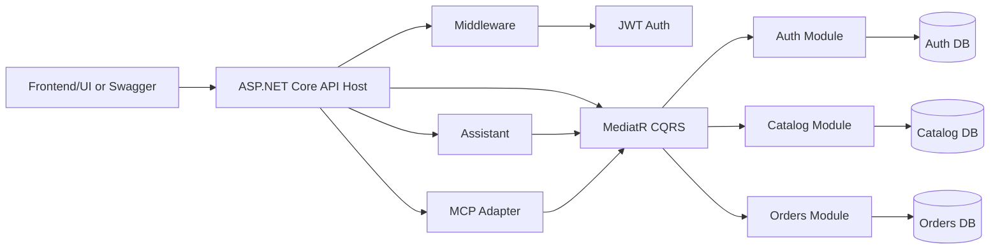
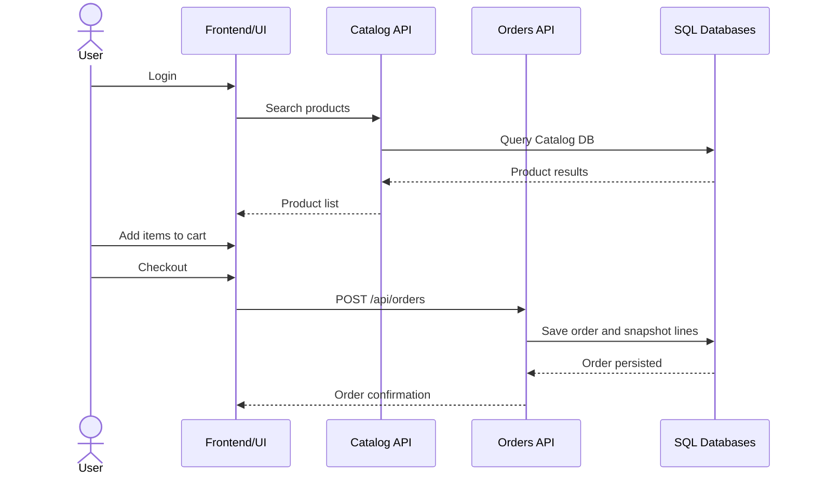
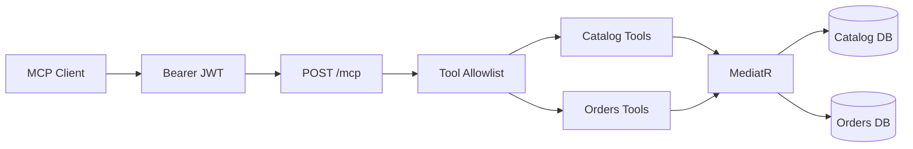
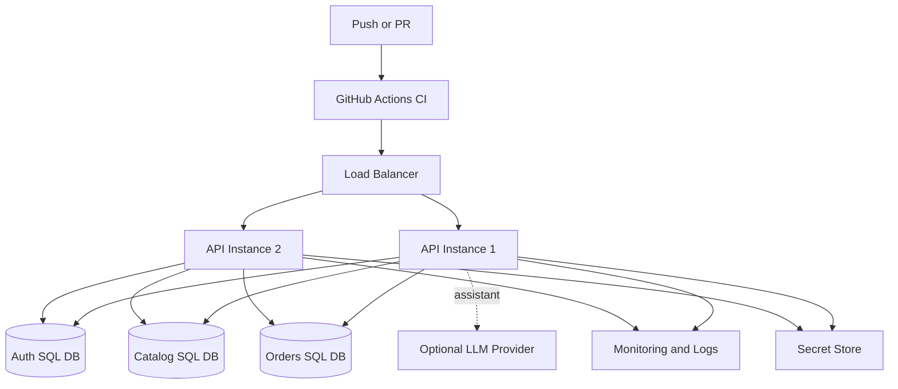

# ZY-Commerce Backend

Technical Demo Package

.NET 9 ASP.NET Core modular monolith for ecommerce APIs.

Speaker cue: "This demo shows the backend foundation, the architecture decisions, and the main user journey from login to checkout and assistant/MCP usage."

---

# Executive Summary

- Implemented Auth, Catalog, Orders, platform diagnostics, MCP, and backend Assistant APIs.
- Solves the need for a maintainable ecommerce backend with clear business boundaries.
- Provides secure user flows, product discovery, checkout, and order history.
- Establishes a foundation for future integrations such as payments, inventory, notifications, and richer AI tooling.

Speaker cue: "The important part is not only that endpoints exist, but that each capability has ownership and testable boundaries."

---

# System Architecture



Speaker cue: "One deployed API, multiple internally isolated modules."

---

# Architecture Pattern

- Modular monolith: simple deployment, strong boundaries.
- Clean Architecture per module:
  - Domain: aggregates and value objects.
  - Application: CQRS handlers and validators.
  - Infrastructure: EF Core, repositories, migrations.
  - Contracts: API DTOs.
- API layer owns transport, middleware, Swagger, health checks, MCP, and Assistant.

Speaker cue: "This gives us microservice-style ownership without distributed-system cost at this stage."

---

# Implemented Modules

| Module | Main Capabilities | Security |
|---|---|---|
| Auth | Register, login, current user, JWT issuing | Public login/register; protected current user |
| Catalog | Create, search, details, update, deactivate, reactivate | Public reads; protected writes |
| Orders | Create order, list my orders, get my order details | Fully protected and owner-scoped |
| Platform | Health, logging, errors, Swagger, MCP, Assistant | Protected tool/assistant surfaces |

Speaker cue: "Auth, Catalog, and Orders do not reference each other directly."

---

# Main Business Flow



Speaker cue: "Checkout stores product snapshots so order history stays stable."

---

# Auth Deep Dive

- `POST /api/auth/users/register`
- `POST /api/auth/users/login`
- `GET /api/auth/users/me`

Key behavior:

- Email/password validation.
- Duplicate email protection.
- Password hashing.
- JWT access tokens with `sub`, `email`, `jti`, and `iat`.
- JWT validation for issuer, audience, signing key, lifetime, and expiration.

Speaker cue: "The JWT subject claim becomes the source of truth for buyer identity."

---

# Catalog Deep Dive

- Public reads:
  - `GET /api/catalog/products`
  - `GET /api/catalog/products/{productId}`
- Protected writes:
  - `POST /api/catalog/products`
  - `PUT /api/catalog/products/{productId}`
  - `DELETE /api/catalog/products/{productId}`
  - `POST /api/catalog/products/{productId}/reactivate`

Key behavior:

- Unique SKU.
- Product lifecycle.
- Catalog-owned price.
- Paged no-tracking search.

Speaker cue: "Catalog owns product state; Orders only captures what was bought."

---

# Orders Deep Dive

- `POST /api/orders`
- `GET /api/orders`
- `GET /api/orders/{orderId}`

Key behavior:

- All endpoints protected.
- Buyer id always comes from JWT `sub`.
- Cross-user order reads return `404`.
- Order lines store product id, SKU, name, unit price, and quantity as snapshots.
- Order total is calculated from line snapshots.

Speaker cue: "The snapshot decision is deliberate: historical orders should not change when Catalog changes."

---

# Database Model

```mermaid
erDiagram
    USER ||--o{ ORDER : "logical buyer id"
    ORDER ||--|{ ORDER_LINE : contains
    PRODUCT ||..o{ ORDER_LINE : "snapshot source"

    USER {
        guid Id PK
        string Email UK
        string PasswordHash
        bool IsActive
    }

    PRODUCT {
        guid Id PK
        string Sku UK
        string Name
        decimal Price
        bool IsActive
    }

    ORDER {
        guid Id PK
        guid BuyerId IDX
        string Status
        decimal TotalAmount
        datetime CreatedAt
    }

    ORDER_LINE {
        guid Id PK
        guid OrderId FK
        guid ProductId
        string ProductSku
        string ProductName
        decimal UnitPrice
        int Quantity
    }
```

Speaker cue: "Separate EF Core contexts preserve module ownership."

---

# MCP Feature Architecture



Approved tools:

- `catalog_search_products`
- `catalog_get_product_by_id`
- `orders_get_order_by_id`
- `orders_create_order`

Speaker cue: "MCP is an authenticated adapter. It does not get direct database access."

---

# MCP Safety Model

- `/mcp` requires bearer authentication.
- Tools dispatch through existing Application/CQRS requests.
- No direct EF Core, repositories, Domain internals, raw SQL, or secrets.
- Order reads are scoped to the authenticated user.
- `orders_create_order` requires explicit `confirmedByUser`.
- Auth tools, token access, migrations, app settings, and cross-user order access are intentionally absent.

Speaker cue: "The safety story is allowlist first, authenticated scope second, and no internal bypass."

---

# Assistant Endpoint

- Endpoint: `POST /api/assistant/query`
- Protected by bearer authentication.
- Supports safe read-only questions:
  - Recent orders.
  - Total spend.
  - Products ordered.
  - Orders containing product/SKU/name.
  - Product frequency.
  - Products under an amount.
- Unsafe, mutating, admin, SQL, token, and cross-user requests return `unsupported: true`.

Speaker cue: "Assistant orchestration composes existing queries; it does not create new persistence paths."

---

# Platform Readiness

- Global exception middleware.
- `ValidationProblemDetails` for validation errors.
- Correlation id support with `X-Correlation-ID`.
- Structured request, exception, readiness, and JWT logs.
- Health endpoints:
  - `/health/live`
  - `/health/ready`
- Swagger enabled in Development with bearer authorization support.
- GitHub Actions CI runs restore, build, and test.

Speaker cue: "This makes the backend demoable and supportable, not just functional."

---

# Deployment View



Speaker cue: "The repo does not yet include Docker or IaC, but the API is stateless and horizontally scalable."

---

# Live Demo Flow

1. Register a user.
2. Login and capture bearer token.
3. Load current user.
4. Create a product.
5. Search catalog.
6. Add product to cart in UI.
7. Checkout and create order.
8. List current user's orders.
9. Open order details.
10. Ask assistant: "What is my total spend?"
11. Ask unsafe assistant request and show safe rejection.

Speaker cue: "For every step, call out the API, backend handler, and database effect."

---

# Key Technical Decisions

- Modular monolith first.
- Separate DbContexts per bounded context.
- Orders store product snapshots.
- JWT `sub` is the buyer identity source.
- Catalog reads are public; writes are protected.
- MCP and Assistant stay in the API adapter layer.
- LLM interpretation is config-gated and treated as untrusted output.

Speaker cue: "These decisions keep delivery fast while protecting the architecture from accidental coupling."

---

# Tradeoffs And Next Steps

Current tradeoffs:

- No refresh tokens, roles, or permissions yet.
- No Redis/cache layer yet.
- No outbox or notification service yet.
- Checkout currently trusts product snapshot data from the client.
- No production Docker/IaC in this repo yet.

Next improvements:

- Add refresh tokens and role-based authorization.
- Add checkout validation against Catalog.
- Add outbox notifications.
- Add cache/search optimization.
- Add production deployment assets and observability dashboards.

Speaker cue: "The system is intentionally shaped for these next increments."

---

# Closing

ZY-Commerce Backend now provides:

- Secure ecommerce API foundation.
- Clear module ownership.
- Demo-ready buyer journey.
- MCP and Assistant readiness.
- Practical path to production hardening.

Speaker cue: "The takeaway is a backend that is usable today and structured for the next wave of features."

