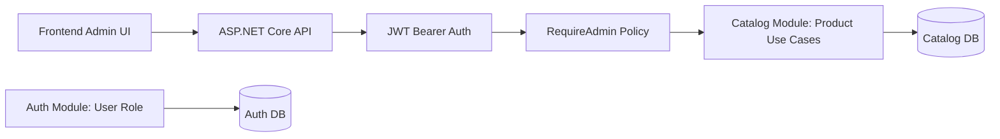
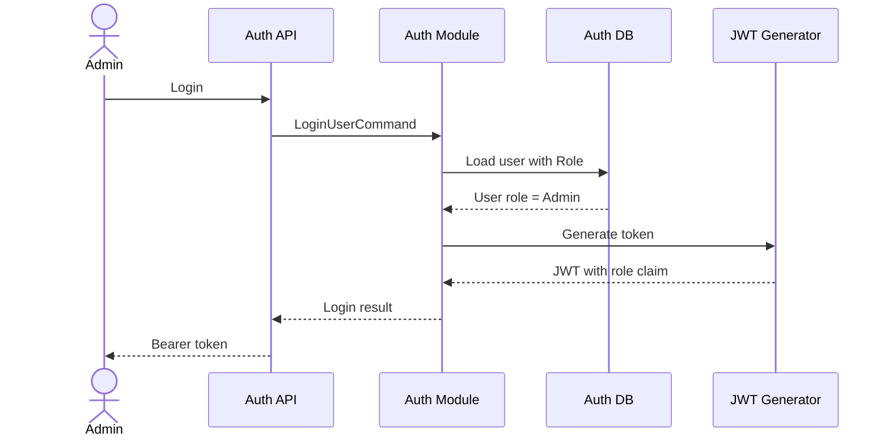
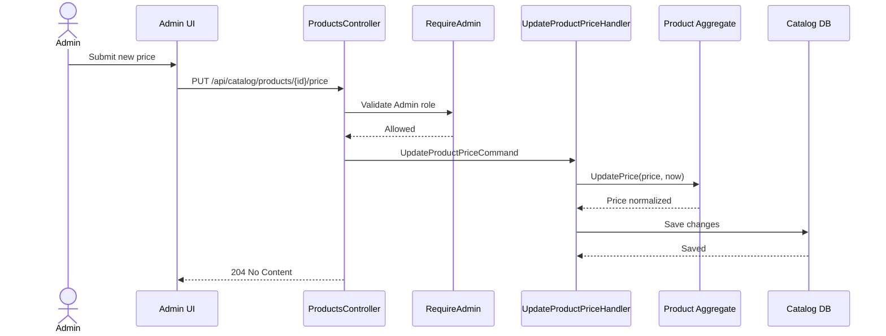

# Admin Product Management

Backend feature for Admin-only product creation, details update, price update, deactivation, and reactivation.

Speaker cue: "This feature turns product writes from authenticated-only into Admin-only while preserving public Catalog reads and existing customer flows."

---

# Business Purpose

- Give internal Admin users safe control over Catalog product data.
- Keep customer-facing product browsing, cart, and order flows unchanged.
- Prevent regular customers from creating or changing products.
- Support the frontend Admin UI with clear `401` and `403` behavior.

Speaker cue: "The business goal is simple: customers can shop, Admins can manage products."

---

# Problem Solved

Before:

- Catalog write endpoints required authentication only.
- Any authenticated user could call product write APIs.
- Price updates did not have a dedicated endpoint.

After:

- Catalog writes require the `Admin` role.
- Customer users receive `403 Forbidden`.
- Unauthenticated callers receive `401 Unauthorized`.
- Product price has a dedicated Admin-only update route.

Speaker cue: "The important security change is authenticated is no longer enough for Catalog writes."

---

# Implementation Architecture

Speaker cue: "Auth owns role state, API owns policy enforcement, and Catalog owns product behavior."

---

# Auth Role And JWT Flow

Speaker cue: "The role claim is produced by Auth during login; the frontend does not invent admin status."

---

# RequireAdmin Policy Boundary

- `RequireAdmin` is configured in the API host.
- Policy requires authenticated user.
- Policy requires role `Admin`.
- Catalog write endpoints use `[Authorize(Policy = "RequireAdmin")]`.
- Catalog read endpoints remain public.

Speaker cue: "Authorization is enforced at the transport boundary, before Catalog handlers run."

---

# Catalog Admin Endpoint Table

| Endpoint | Method | Role | Purpose |
|---|---|---|---|
| `/api/catalog/products` | POST | Admin | Create product |
| `/api/catalog/products/{productId}` | PUT | Admin | Update name/description |
| `/api/catalog/products/{productId}/price` | PUT | Admin | Update price |
| `/api/catalog/products/{productId}` | DELETE | Admin | Deactivate product |
| `/api/catalog/products/{productId}/reactivate` | POST | Admin | Reactivate product |

Speaker cue: "Every product write path is now consistently Admin-only."

---

# Price Update Sequence

Speaker cue: "Price update stays separate from product details, matching the existing product design."

---

# 401 vs 403 Demo Script

1. Call `POST /api/catalog/products` without a token.
2. Confirm `401 Unauthorized`.
3. Login as a normal Customer user.
4. Call the same endpoint with Customer token.
5. Confirm `403 Forbidden`.
6. Login as Admin.
7. Call the same endpoint with Admin token.
8. Confirm success.

Speaker cue: "401 means no valid identity; 403 means identity exists but lacks Admin permission."

---

# Admin Happy Path Demo

1. Promote local user to Admin in development database.
2. Login and capture bearer token.
3. Confirm `/api/auth/users/me` returns `role: Admin`.
4. Create product.
5. Update product details.
6. Update product price.
7. Deactivate product.
8. Reactivate product.
9. Confirm Catalog reads show the current product state.

Speaker cue: "This is the core Admin UI backend flow."

---

# Non-Admin Blocked Demo

1. Register/login as a normal Customer.
2. Confirm `/api/auth/users/me` returns `role: Customer`.
3. Attempt product create/update/price/deactivate/reactivate.
4. Confirm every write returns `403 Forbidden`.
5. Confirm `GET /api/catalog/products` still works.

Speaker cue: "Customer users can still browse, but cannot mutate Catalog state."

---

# Historical Order Snapshots

- Orders store product snapshot data on order lines.
- Product name/price changes affect future Catalog reads.
- Future orders capture the latest product data supplied by checkout.
- Existing order line snapshots are not rewritten.

Speaker cue: "Admin product updates are forward-looking; historical order records remain stable."

---

# Test Evidence

- Auth tests cover default Customer role and Admin role representation.
- JWT tests cover role claim emission.
- Catalog tests cover `Product.UpdatePrice`.
- Catalog command tests cover price update handler and validation.
- Architecture tests cover Admin-only Catalog writes.
- Existing MCP and Assistant allowlists remain unchanged.

Speaker cue: "The tests protect both the new behavior and the boundaries we do not want to weaken."

---

# Risks And Tradeoffs

- Local Admin setup is manual and development-only.
- No public Admin registration endpoint was added.
- No role-management UI exists yet.
- No audit logging for Admin product changes yet.
- Existing order snapshots intentionally do not change after product edits.

Speaker cue: "The implementation is intentionally minimal and safe; broader admin management can come later."

---

# Q&A Talking Points

Question: "Can a customer write products?"

Answer: "No. They authenticate successfully but fail the Admin policy with `403`."

Question: "Can Assistant or MCP perform admin writes?"

Answer: "No. No admin tools were added to MCP or Assistant."

Question: "What happens to old orders after a price change?"

Answer: "Nothing. Orders keep historical snapshot prices."

Speaker cue: "Anchor Q&A around ownership: Auth owns roles, API enforces policy, Catalog owns product state, Orders own history."
