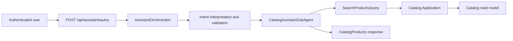
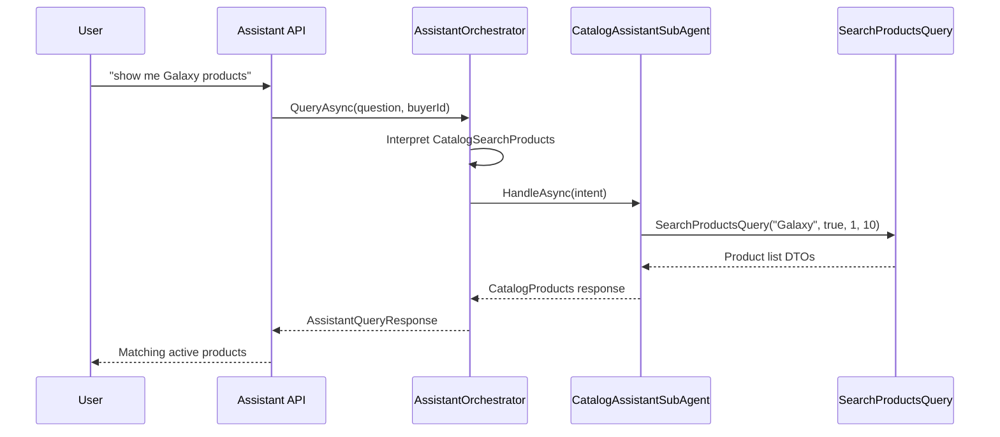

# Assistant Broad Catalog Search Demo Slides

## Slide 1 - Feature Title

Assistant Broad Catalog Search

Speaker cue: Introduce this as a read-only assistant capability that lets a customer ask natural product discovery questions without changing the public assistant response contract.

## Slide 2 - Business Purpose

Customers can now ask questions like:

- show me Galaxy products
- find iPhone products
- search for SKU ABC123
- do you have headphones
- show active products matching laptop

Speaker cue: Emphasize that this makes existing Catalog search available through the assistant, instead of creating a new business workflow.

## Slide 3 - Architecture Overview

Speaker cue: Point out that the assistant remains API-layer orchestration and Catalog Application still owns product read behavior.

## Slide 4 - Implementation Files

- `src/Api/Ecommerce.Api/Assistant/AssistantIntent.cs`
- `src/Api/Ecommerce.Api/Assistant/AssistantIntentRouter.cs`
- `src/Api/Ecommerce.Api/Assistant/AssistantIntentPlanValidator.cs`
- `src/Api/Ecommerce.Api/Assistant/AssistantIntentToolPlan.cs`
- `src/Api/Ecommerce.Api/Assistant/CatalogAssistantSubAgent.cs`
- `src/Api/Ecommerce.Api/Assistant/AssistantOrchestrator.cs`
- `src/Api/Ecommerce.Api/Assistant/HttpAssistantLlmClient.cs`
- `src/Api/Ecommerce.Api/Assistant/GeminiAssistantLlmClient.cs`

Speaker cue: The change is intentionally concentrated in assistant API-layer routing/orchestration and provider intent guidance.

## Slide 5 - Contract And Data Scope

- Reuses `AssistantResponseTypes.CatalogProducts`.
- Reuses `AssistantCatalogProductsData`.
- Reuses `AssistantProductCardDto`.
- Uses existing `catalog_search` tool name.
- Uses `dataScope = catalog-public`.
- Uses active-only CQRS search: `IsActive = true`.

Speaker cue: The frontend contract stays stable; broad catalog search simply returns the existing product-list structured data shape.

## Slide 6 - Main Sequence

Speaker cue: The CQRS query already searches SKU and name, so no schema or repository shortcut was needed.

## Slide 7 - Safety Behavior

- No admin or write assistant action was added.
- Unsafe questions such as deactivate/update/admin/SQL remain unsupported.
- Public assistant search does not return inactive products through the CQRS fallback path.
- Raw SQL and `genericTable` are not exposed.
- Text-to-SQL internals remain unchanged.

Speaker cue: This is a capability addition, but it stays inside the same read-only assistant safety model.

## Slide 8 - Test Evidence

- Deterministic routing tests for product name, SKU, and natural text.
- Plan validation tests for valid and invalid `CatalogSearchProducts` model plans.
- Sub-agent/orchestrator tests for active-only dispatch, structured product data, no-result response, and Text-to-SQL fallback.
- Architecture boundary tests continue to enforce no EF, repository, Domain, Infrastructure, MCP, provider, Text-to-SQL, or write-command dependency in `CatalogAssistantSubAgent`.

Verification:

- `dotnet build Ecommerce.sln --artifacts-path artifacts\broad-catalog-search-build`: passed
- `dotnet test Ecommerce.sln --artifacts-path artifacts\broad-catalog-search-test`: passed
- Architecture tests: 182 passed

Speaker cue: The test count grew because the assistant behavior is protected at the routing, validation, orchestration, and boundary layers.

## Slide 9 - Risks And Tradeoffs

- First version searches only SKU and product name because that is the existing Catalog Application search behavior.
- Description search was not added because it would broaden Catalog search behavior beyond the approved scope.
- Results are capped at 10 for assistant responses.
- `AssistantCatalogProductsData.MaxPrice` remains null for broad search to preserve the existing frontend contract.

Speaker cue: Call out that the implementation favors contract stability and reuse over a larger search redesign.

## Slide 10 - Q&A Talking Points

- Why no migration? Existing Catalog search already supports SKU/name through the read model.
- Why no frontend change? Existing `catalogProducts` structured data already fits this response.
- Why no Text-to-SQL change? SQL remains optional first-pass and falls back to CQRS safely.
- Why active-only? Public assistant product discovery should not surface inactive products.

Speaker cue: Keep the discussion centered on reusing stable backend boundaries rather than inventing a parallel assistant search system.
