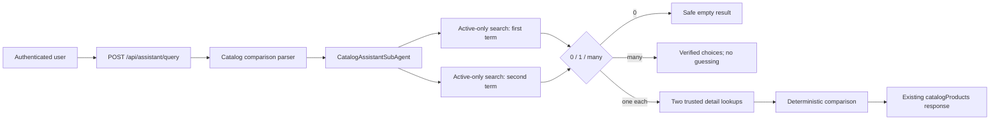
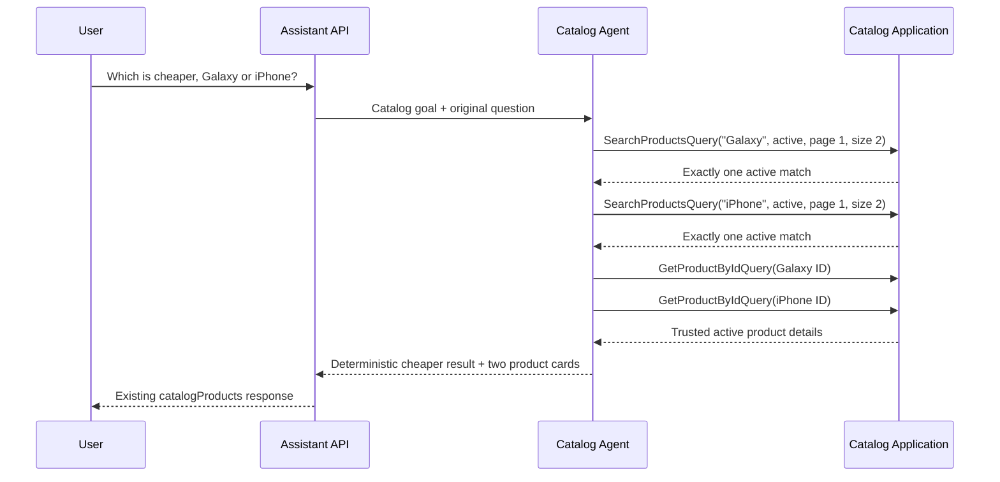

# Assistant Product Comparison By Name Or SKU

Speaker cue: Introduce this as a read-only demo capability that compares two real active Catalog products without requiring internal product IDs.

---

## Business Purpose

- Ask natural questions such as `compare Galaxy and iPhone`.
- Resolve each side independently by name, SKU, description, or search text.
- Compare verified public product facts and trusted decimal prices.
- Return choices instead of guessing when either side is ambiguous.

Speaker cue: Emphasize that the assistant treats ambiguity as a user-visible state, not permission to choose the first search result.

---

## Problem Solved

- Product discovery previously returned lists or one product detail.
- Comparison needs two independently verified products.
- A language model must not invent a match, price, or price difference.
- Missing, ambiguous, duplicate, and equal-price outcomes need safe behavior.

Speaker cue: Frame the feature as deterministic evidence validation around a bounded model/tool loop.

---

## Architecture Overview

Speaker cue: Point out that orchestration stays in the API layer while Catalog data remains owned by existing Application queries.

---

## Implementation Files

- `CatalogComparisonRequest.cs` parses the supported two-sided grammar.
- `AssistantIntentRouter.cs` recognizes comparison before generic SKU search.
- `SearchCatalogProductsTool.cs` returns the normalized search evidence.
- `CatalogAssistantSubAgent.cs` validates both searches and builds the answer.
- `CatalogAgentInstructions.cs` guides the bounded tool sequence.
- Architecture tests cover routing, match cardinality, trusted prices, and safety.

Speaker cue: Explain that no Catalog module or persistence implementation needed to change.

---

## Existing API And Contracts Reused

- Endpoint: `POST /api/assistant/query`
- Tools: `catalog_search_products`, `catalog_get_product`
- Queries: `SearchProductsQuery`, `GetProductByIdQuery`
- Response type: `catalogProducts`
- Data: `AssistantCatalogProductsData`
- Product fields: name, SKU, description, price, and active status

Speaker cue: Existing contracts keep the feature backend-only and avoid frontend or MCP changes.

---

## Safe Resolution Rules

| Result per side | Assistant behavior |
|---|---|
| Zero active matches | Return a supported empty result |
| Multiple active matches | Return bounded choices and ask for an exact SKU |
| One match on each side | Load both trusted details and compare |
| Both terms resolve to one product | Ask for a different second product |
| Equal trusted prices | State that neither product is cheaper |

Speaker cue: Walk through the table as the feature’s no-guessing contract.

---

## Main Sequence

Speaker cue: Stress that the model proposes tool calls, but C# validates exact searches, trusted IDs, detail completion, and the price calculation.

---

## Security And Boundaries

- Active public Catalog scope only.
- No assistant write or admin tools.
- No raw SQL or `genericTable` output.
- No direct DbContext, repository, Domain, or module-internal access.
- Product descriptions remain untrusted data.
- Text-to-SQL remains separately feature-flagged and defaults to disabled.

Speaker cue: The comparison adds read orchestration, not new authority.

---

## Database Impact

- No migration or schema change.
- No package addition.
- No new query or persistence path.
- Existing Catalog search matches SKU, name, and nullable description.
- Existing detail query remains authoritative for final values.

Speaker cue: Highlight that this is a composition of established CQRS reads.

---

## Demo Script

1. Ask `compare Galaxy and iPhone`.
2. Ask `which is cheaper, Galaxy or iPhone?`.
3. Ask `compare SKU ABC123 with SKU MANUAL-IPHN-001`.
4. Use an ambiguous term and show choices without a detail comparison.
5. Use a missing term and show the supported empty response.
6. Compare two equal-priced products and show that neither is cheaper.
7. Ask for a product write and show that it remains unsupported.

Speaker cue: Keep the live demo centered on unique, ambiguous, missing, and cheaper-price branches.

---

## Verification Evidence

- Focused comparison and verification-cleanup tests: 37 passed.
- `dotnet restore Ecommerce.sln`: passed.
- `dotnet build Ecommerce.sln --no-restore`: passed with zero errors.
- Auth unit tests: 68 passed.
- Catalog unit tests: 86 passed.
- Orders unit tests: 23 passed.
- Architecture tests: 221 passed.
- `git diff --check`: passed.

Speaker cue: Mention that the known `.worktrees` discovery and Text-to-SQL default blockers were restored to their previously validated safe state.

---

## Risks And Tradeoffs

- Matching remains substring-based, so broad terms can be ambiguous.
- Supported comparison grammar is intentionally conservative.
- Search and detail are separate reads rather than a transactional snapshot.
- Model availability still affects the bounded tool loop.
- Comparison is limited to two products and public Catalog fields.

Speaker cue: The design favors safe failure and explicit choices over fuzzy or speculative matching.

---

## Q&A

- Why not pick the first match? It could compare the wrong product.
- Why use details after search? Search establishes trust; detail supplies final authoritative values.
- Why no new response DTO? Existing product-list data already carries both verified products.
- Can it update prices? No. The tool registry remains strictly read-only.
- Does it use Text-to-SQL? No. It reuses existing Catalog CQRS queries.

Speaker cue: Close by reinforcing contract reuse, trusted data, and unchanged write boundaries.
