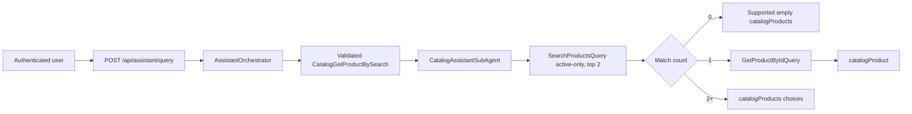
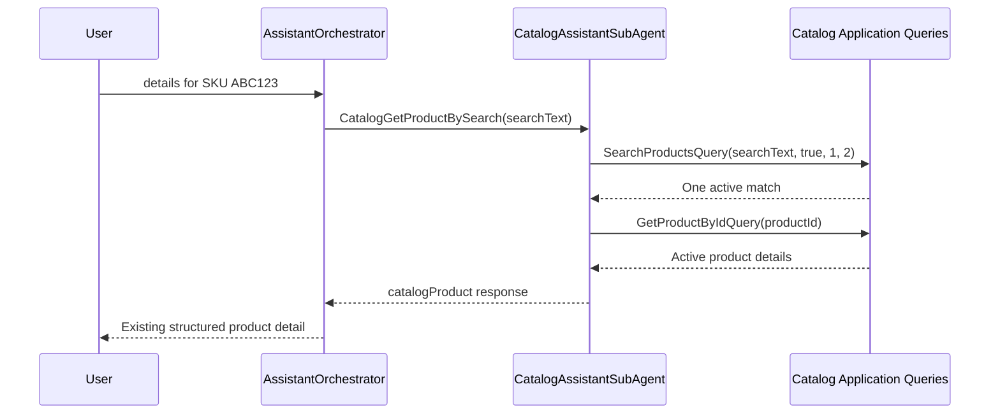

# Assistant Product Detail By Natural Name Or SKU

Speaker cue: Introduce this as a read-only extension of broad catalog search that removes the need for customers to know internal product IDs.

---

## Business Purpose

- Ask for product details using a name, SKU, or natural phrase.
- Return full existing product detail when one active product matches.
- Ask the customer to choose when a phrase is ambiguous.
- Preserve safe supported empty responses when nothing matches.

Speaker cue: Emphasize that ambiguity is visible to the customer instead of being hidden behind a guessed result.

---

## Architecture

Speaker cue: Point out that assistant orchestration stays in the API while Catalog Application queries remain the business-read boundary.

---

## Intent And Safety

- Intent: `CatalogGetProductBySearch`
- Required argument: `searchText`
- Exact allowed tools: `catalog_search`, `catalog_get_product`
- No buyer/user scope, product ID, amount, SQL, token, admin, or write arguments
- Search text remains bounded and passes `AssistantSafetyPolicy`

Speaker cue: Explain that provider output is still untrusted and must pass deterministic backend validation.

---

## Match Behavior

| Active matches | Result | Tools actually reported |
|---|---|---|
| Zero | Empty `catalogProducts` with friendly not-found answer | `catalog_search` |
| One | Existing `catalogProduct` detail response | `catalog_search`, `catalog_get_product` |
| Multiple | Up to two `catalogProducts` choices; no guessing | `catalog_search` |

Speaker cue: Call out the second active-state check after detail lookup, which protects against a concurrent deactivation.

---

## Existing Contracts Reused

- `AssistantQueryResponse` unchanged
- `AssistantResponseTypes.CatalogProduct`
- `AssistantCatalogProductData`
- `AssistantResponseTypes.CatalogProducts`
- `AssistantCatalogProductsData`
- `AssistantProductCardDto`

Speaker cue: This capability requires no frontend DTO or endpoint changes because it uses response types the client already understands.

---

## Text-to-SQL And Database Impact

- Text-to-SQL internals, prompts, validation, execution, views, mapper, configuration, and feature flag are unchanged.
- Existing Text-to-SQL failure/unmapped behavior can fall back to this CQRS path.
- No migration or schema change.
- No raw SQL or `genericTable` appears in public output.

Speaker cue: Separate natural-language routing improvements from the independently governed Text-to-SQL safety boundary.

---

## Main Sequence

Speaker cue: Highlight that the second query happens only when the active search produces exactly one match.

---

## Demo Script

1. Ask `show me details for Galaxy` and show `catalogProduct`.
2. Ask `details for SKU ABC123` and show SKU resolution.
3. Ask `what is the price of Galaxy S24` and show supported empty choices when absent.
4. Ask an ambiguous phrase and show two choices without a detail lookup.
5. Ask `show me Galaxy products` to demonstrate broad-search regression safety.
6. Ask `deactivate product` to demonstrate write refusal.

Speaker cue: Keep the demo focused on the three match-count branches and the unchanged safety boundary.

---

## Verification Evidence

- Restore passed with known NU1900 vulnerability-feed warnings.
- Build passed with zero errors.
- Catalog unit tests: 83 passed.
- Auth unit tests: 68 passed.
- Orders unit tests: 23 passed.
- Architecture tests: 209 passed.
- Manual API verification passed for unique, zero, multiple, broad-search regression, price-filter regression, inactive exclusion, and write refusal.

Speaker cue: Note that the new behavior is covered at routing, validation, orchestration, fallback, serialization-safety, and architecture levels.

---

## Risks And Tradeoffs

- Search and detail are two reads, so active state is checked again before exposure.
- Ambiguous queries return only two bounded choices.
- Matching semantics remain Catalog-owned SKU/name search; no ranking or fuzzy matching was added.
- Natural routing remains deliberately phrase-based in deterministic mode.

Speaker cue: The conservative behavior favors visible ambiguity and safe failure over an apparently convenient but incorrect guess.

---

## Q&A

- Why not return the first match? It could be the wrong product.
- Why not add a new frontend shape? Existing product and product-list shapes already cover every branch.
- Why not search EF directly? Assistant orchestration must preserve Application/CQRS boundaries.
- Does this enable product writes? No; all write/admin prompts remain unsupported.

Speaker cue: Close by reinforcing that this is capability reuse and orchestration, not a new persistence or frontend feature.
