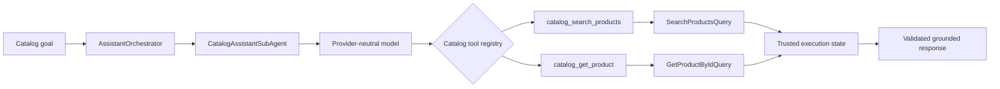

# Bounded Autonomous Catalog Agent

## Slide 1 — Outcome

- Safe natural-language Catalog goals can use a bounded multi-step read flow.
- The model proposes tool calls; deterministic server code remains authoritative.
- Only active public products can reach structured assistant responses.

Speaker cue: Emphasize that autonomy applies to sequencing two approved reads, not to arbitrary backend execution.

## Slide 2 — Runtime Flow

Speaker cue: Domain routing is deterministic; only in-domain search/detail sequencing is model-assisted.

## Slide 3 — Safety Boundary

- Registry contains exactly `catalog_search_products` and `catalog_get_product`.
- Search always applies `IsActive = true`; maximum-price filtering runs in the database.
- Detail IDs must come from a successful search in the same execution.
- Tool arguments, result selections, cheapest/most-expensive claims, and output DTOs are validated in C#.
- Hard limits cover iterations, calls per iteration, conversation messages, and page size.
- No writes, raw SQL, generic tables, repositories, DbContexts, MCP calls, or arbitrary MediatR requests.

Speaker cue: Product names and descriptions are also untrusted data and cannot expand the tool policy.

## Slide 4 — Demo Script

1. Verify `GET /health/ready` is healthy.
2. Ask: `Show me details for Galaxy Test Phone`.
3. Ask: `Find the cheapest active phone under 750 and show me its full details`.
4. Inspect `responseType`, `dataScope`, `toolsUsed`, structured products, and active flags.
5. Ask: `deactivate product` and confirm `unsupported=true` with no tools.
6. Confirm no raw SQL or `genericTable` appears.

Speaker cue: A live model provider needs available quota; scripted-model tests demonstrate the complete loop independently of provider availability.

## Slide 5 — Verification Evidence

- Solution tests: 385 passed after rebasing onto the prerequisite merge.
- Focused autonomous-agent coverage includes multi-step search/detail, fabricated IDs, inactive rows, malformed/unknown tools, prompt injection, limits, cancellation, grounding, provider payloads, and database-filter ordering.
- Formatting verification: zero files required changes.
- Local readiness: HTTP 200 `Healthy` after applying existing migrations.
- Live Gemini execution: safely failed before tools because the configured project returned HTTP 429 `RESOURCE_EXHAUSTED`.

Speaker cue: The 429 is an external quota blocker; the API returned a stable safe response and exposed no data.

## Slide 6 — Tradeoffs and Q&A

- Provider availability now matters when the Catalog agent is enabled; startup fails fast for incomplete configuration and runtime failures fail closed.
- Search remains paginated, so answers are scoped to returned pages rather than claiming an exhaustive catalog scan.
- Trusted identifiers are request-local; durable conversation state is intentionally not introduced.
- Text-to-SQL, Orders behavior, frontend, MCP, schema, and migrations are unchanged.

Speaker cue: Future work should focus on provider operations and evaluation, not broader permissions.
