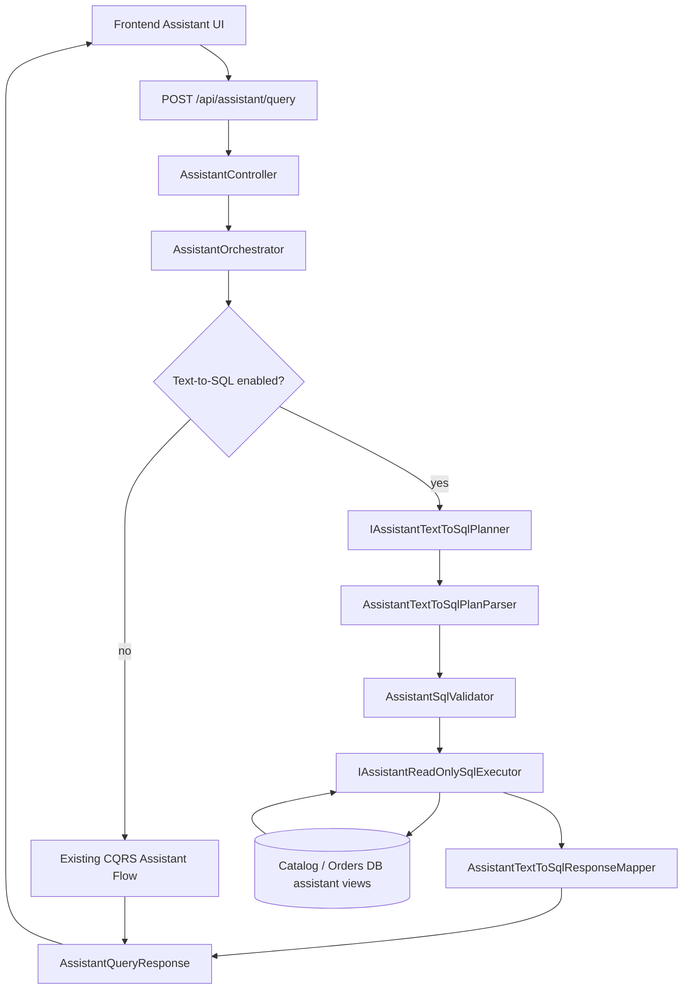
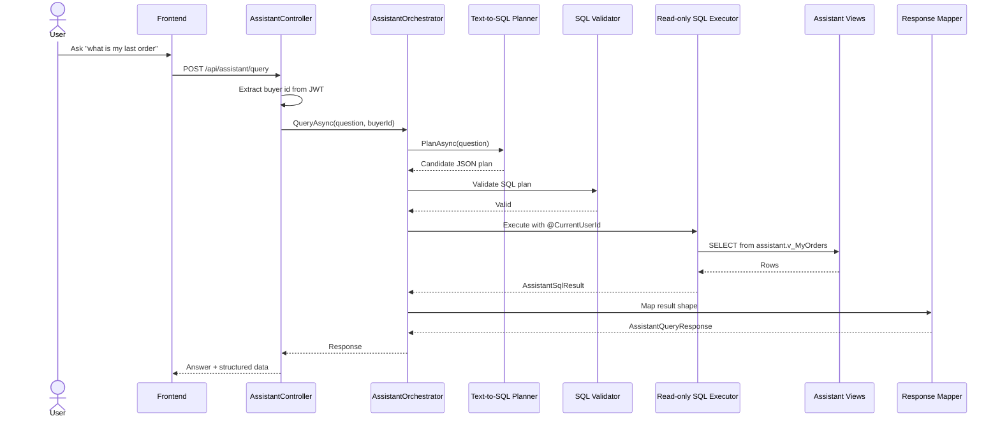

# Text-to-SQL Assistant

Backend feature that lets authenticated users ask natural-language ecommerce questions and receive safe read-only answers from approved database views.

Speaker cue: "This feature turns a customer question into a validated read-only SQL plan, while preserving the existing assistant fallback path."

---

# Business Purpose

- Let customers ask flexible questions about their own orders.
- Let users search product data through natural language.
- Reuse existing assistant response shapes so the frontend does not need a new contract.
- Keep all SQL read-only, scoped, and hidden from the frontend.
- Preserve existing assistant behavior when Text-to-SQL is disabled or fails safely.

Speaker cue: "The goal is better question coverage without opening a raw SQL surface."

---

# Feature Flag Boundary

Text-to-SQL is controlled by:

```text
Assistant:TextToSql:Enabled
```

When disabled:

- The Text-to-SQL planner is not called.
- SQL validator/executor are not called from the assistant request path.
- Existing assistant behavior remains unchanged.

When enabled:

- Text-to-SQL runs as a first-pass path.
- Existing CQRS assistant flow remains fallback.

Speaker cue: "The feature is reversible and conservative. Turning the flag off returns to the old assistant path."

---

# High-Level Architecture



Speaker cue: "There are two paths: Text-to-SQL first when enabled, existing CQRS assistant as fallback."

---

# End-To-End Sequence



Speaker cue: "The authenticated user id is taken from the JWT and supplied by the backend, not by the model."

---

# Frontend Request

The frontend sends natural language only:

```http
POST /api/assistant/query
Authorization: Bearer <customer-jwt>
Content-Type: application/json
```

```json
{
  "question": "what is my last order"
}
```

The frontend does not send:

- SQL
- `buyerId` or `userId`
- data source selection
- tool selection

Speaker cue: "The user asks a question; the backend owns identity, data scope, validation, and execution."

---

# Controller Boundary

`AssistantController`:

- Requires bearer authentication.
- Reads the user id from the JWT `sub` claim.
- Rejects requests without a valid authenticated user id.
- Passes only the question and backend-authenticated `buyerId` to `AssistantOrchestrator`.

```csharp
QueryAsync(question, buyerId, cancellationToken)
```

Speaker cue: "The controller is where user scope becomes backend-owned."

---

# Orchestrator Decision

`AssistantOrchestrator` checks:

```csharp
textToSqlOptions.Value.IsEnabled
```

If enabled:

1. Try Text-to-SQL.
2. Return mapped response if successful.
3. Fall back to existing CQRS assistant flow if any Text-to-SQL step fails safely.

If disabled:

1. Skip Text-to-SQL completely.
2. Use existing assistant flow.

Speaker cue: "Text-to-SQL is optional. The existing assistant path stays alive."

---

# LLM Planner Contract

The planner asks the LLM for JSON only:

```json
{
  "supported": true,
  "dataSource": "orders",
  "sql": "SELECT TOP (1) ...",
  "resultShape": "orderList",
  "reason": null
}
```

Unsupported requests return:

```json
{
  "supported": false,
  "dataSource": null,
  "sql": null,
  "resultShape": "unsupported",
  "reason": "Write or admin operations are not supported."
}
```

Speaker cue: "The model plans candidate SQL; it never executes anything."

---

# Approved View Surface

Catalog database:

- `assistant.v_ProductSearch`
- `assistant.v_ProductDetails`

Orders database:

- `assistant.v_MyOrders`
- `assistant.v_MyOrderLines`
- `assistant.v_MyOrderSummary`

Forbidden:

- Base tables
- Auth internals
- Admin/write operations
- Cross-user order access
- Raw SQL from frontend

Speaker cue: "The model is only allowed to target views created for assistant read access."

---

# Example: Last Order Plan

Question:

```text
what is my last order
```

Candidate plan:

```json
{
  "supported": true,
  "dataSource": "orders",
  "sql": "SELECT TOP (1) OrderId, Status, TotalAmount, CreatedAt, LineCount FROM assistant.v_MyOrders WHERE BuyerUserId = @CurrentUserId ORDER BY CreatedAt DESC",
  "resultShape": "orderList",
  "reason": null
}
```

Speaker cue: "This is still untrusted until the backend parser and SQL validator accept it."

---

# Example SQL Query

For:

```text
what is my last order
```

The safe SQL shape is:

```sql
SELECT TOP (1)
    OrderId,
    Status,
    TotalAmount,
    CreatedAt,
    LineCount
FROM assistant.v_MyOrders
WHERE BuyerUserId = @CurrentUserId
ORDER BY CreatedAt DESC
```

`@CurrentUserId` is supplied by the backend from the authenticated JWT.

Speaker cue: "The query is owner-scoped by a parameter, not by a literal user id from the LLM."

---

# Validation Rules

`AssistantSqlValidator` requires:

- SQL Server dialect.
- Single `SELECT TOP (n)` query.
- Approved assistant views only.
- No base tables.
- No comments or multiple statements.
- No `UNION`.
- No write/admin SQL.
- Orders queries must include `BuyerUserId = @CurrentUserId`.

Speaker cue: "The validator treats LLM output as hostile input."

---

# Read-Only Execution

Execution uses dedicated read-only connection strings:

```text
ConnectionStrings:AssistantCatalogReadOnly
ConnectionStrings:AssistantOrdersReadOnly
```

Execution does not use:

- Normal application DB connections
- EF Core DbContexts
- Write repositories
- Admin database users

Speaker cue: "Even if a query reached execution, it still runs as a restricted read-only principal."

---

# Mapping SQL Results

`AssistantTextToSqlResponseMapper` converts tabular SQL results to existing response types:

| Result Shape | Response Type | Data |
|---|---|---|
| `orderList` | `recentOrders` | `AssistantOrdersData` |
| `spendSummary` | `orderSummaryAnalytics` | `AssistantOrderSummaryAnalyticsData` |
| `productList` | `catalogProducts` | `AssistantCatalogProductsData` |
| `productDetails` | `catalogProduct` | `AssistantCatalogProductData` |
| `orderDetails` | `orderedProducts` | `AssistantOrderedProductsData` |

`genericTable` is not exposed publicly.

Speaker cue: "The frontend sees the same contract it already understands."

---

# Example API Response

Example response for "what is my last order":

```json
{
  "answer": "Your recent orders are: 8f7f6d2f-0f8a-4c3b-9c10-111111111111 (Created) total 42.50 on 2026-06-25.",
  "toolsUsed": ["orders_search"],
  "dataScope": "authenticated-user",
  "unsupported": false,
  "responseType": "recentOrders",
  "data": {
    "orders": [
      {
        "orderId": "8f7f6d2f-0f8a-4c3b-9c10-111111111111",
        "status": "Created",
        "totalAmount": 42.50,
        "createdAt": "2026-06-25T12:00:00Z",
        "lineCount": 2,
        "lines": []
      }
    ]
  }
}
```

Speaker cue: "Generated SQL is not returned. The response is normal assistant output."

---

# Product Search Example

Question:

```text
find products under 20
```

Candidate SQL:

```sql
SELECT TOP (10)
    ProductId,
    Name,
    Sku,
    Description,
    PriceAmount,
    IsActive
FROM assistant.v_ProductSearch
WHERE IsActive = 1
  AND PriceAmount < 20
ORDER BY PriceAmount ASC
```

Response type:

```text
catalogProducts
```

Speaker cue: "Catalog queries use public catalog scope and do not include order ownership filters."

---

# Total Spend Example

Question:

```text
what is my total spend
```

Candidate SQL:

```sql
SELECT TOP (1)
    TotalOrders,
    TotalSpend,
    LastOrderDate
FROM assistant.v_MyOrderSummary
WHERE BuyerUserId = @CurrentUserId
```

Response type:

```text
orderSummaryAnalytics
```

Speaker cue: "Spend summary is still scoped to the authenticated user."

---

# Unsupported Write Example

Question:

```text
deactivate product
```

Expected plan:

```json
{
  "supported": false,
  "dataSource": null,
  "sql": null,
  "resultShape": "unsupported",
  "reason": "Write or admin operations are not supported."
}
```

Expected response:

```json
{
  "unsupported": true,
  "dataScope": "none"
}
```

Speaker cue: "Text-to-SQL is read-only. Product writes remain admin API operations, not assistant actions."

---

# Fallback Cases

Text-to-SQL falls back to the existing assistant flow when:

- Planner returns unsupported.
- Planner JSON is malformed.
- SQL validation fails.
- Read-only DB connection is missing.
- SQL execution fails.
- Result shape cannot be mapped.
- `genericTable` is returned.
- Provider times out or fails.

Speaker cue: "Failure is safe and boring: use the old assistant path or unsupported response."

---

# Logging And Secrecy

Must not log or return:

- Generated SQL
- Raw prompts
- Raw provider responses
- Connection strings
- API keys
- JWTs or bearer tokens
- Sensitive order data

Allowed diagnostics are limited to safe booleans and fallback stage names.

Speaker cue: "Diagnostics show status, not secrets or user data."

---

# Smoke Test Script

With Text-to-SQL enabled locally and a customer token:

1. Ask `what is my last order`.
2. Confirm `unsupported=false`, `responseType=recentOrders`.
3. Ask `show my recent orders`.
4. Confirm authenticated-user scope.
5. Ask `what is my total spend`.
6. Confirm `responseType=orderSummaryAnalytics`.
7. Ask `find products under 20`.
8. Confirm `dataScope=catalog-public`.
9. Ask `deactivate product`.
10. Confirm `unsupported=true`.

Speaker cue: "These five questions prove happy paths, catalog path, owner scope, and write rejection."

---

# Key Takeaways

- Text-to-SQL is feature-flagged and disabled by default.
- LLM output is candidate SQL only.
- SQL must pass backend validation.
- Execution uses read-only database principals.
- Orders are scoped by backend-authenticated `@CurrentUserId`.
- The frontend contract stays stable.
- Existing CQRS assistant flow remains fallback.
- Admin/write requests remain unsupported.

Speaker cue: "This is a careful migration: more flexible questions, same safety posture."
